# 4장. 모델 훈련

> 선형 회귀부터 경사 하강법, 다항 회귀, 규제, 로지스틱 회귀와 소프트맥스 회귀까지 모델 훈련의 핵심 원리와 실습을 정리한 학습 노트입니다.
>
> 실습 노트북: [04_training_linear_models.ipynb](./04_training_linear_models.ipynb)

## 1. 학습 목표

이 장의 목표는 모델이 데이터를 학습한다는 것이 무엇인지 수식과 코드로 이해하는 것입니다.

- 선형 회귀의 예측식과 비용 함수를 이해합니다.
- 정규 방정식과 경사 하강법으로 모델 파라미터를 구합니다.
- 배치·확률적·미니배치 경사 하강법의 차이를 비교합니다.
- 다항 특성으로 비선형 데이터를 선형 모델로 학습합니다.
- 학습 곡선으로 과소적합과 과대적합을 진단합니다.
- 릿지, 라쏘, 엘라스틱넷, 조기 종료로 모델을 규제합니다.
- 로지스틱 회귀와 소프트맥스 회귀로 분류 확률을 추정합니다.

전체 흐름은 다음과 같습니다.

```text
선형 모델과 비용 함수
  → 닫힌 형태의 해와 경사 하강법
  → 다항 특성으로 모델 확장
  → 학습 곡선으로 일반화 성능 진단
  → 규제로 모델 복잡도 제어
  → 로지스틱·소프트맥스 회귀로 분류
```

---

## 2. 선형 회귀

### 2.1 선형 회귀의 예측식

선형 회귀는 입력 특성의 가중치 합에 편향을 더해 연속적인 값을 예측합니다.

$$
\hat{y}
=
\theta_0+\theta_1x_1+\theta_2x_2+\cdots+\theta_nx_n
$$

벡터 형태로는 다음과 같이 나타낼 수 있습니다.

$$
\hat{y}
=
h_{\boldsymbol{\theta}}(\mathbf{x})
=
\boldsymbol{\theta}^{\top}\mathbf{x}
$$

- $\hat{y}$: 모델의 예측값
- $n$: 특성 수
- $x_i$: $i$번째 특성값
- $\theta_0$: 편향 또는 절편
- $\theta_i$: $i$번째 특성의 가중치
- $\boldsymbol{\theta}$: 모든 모델 파라미터를 담은 벡터
- $\mathbf{x}$: $x_0=1$을 포함한 샘플의 특성 벡터

### 2.2 평균 제곱 오차

모델 훈련은 훈련 세트에서 비용 함수를 가장 작게 만드는 파라미터를 찾는 과정입니다. 선형 회귀에서는 평균 제곱 오차(MSE)를 최소화합니다.

$$
\operatorname{MSE}
\left(
\mathbf{X},h_{\boldsymbol{\theta}}
\right)
=
\frac{1}{m}
\sum_{i=1}^{m}
\left(
\boldsymbol{\theta}^{\top}\mathbf{x}^{(i)}
-y^{(i)}
\right)^2
$$

RMSE는 MSE에 제곱근을 적용한 값입니다. 제곱근은 단조 증가 함수이므로 MSE와 RMSE를 최소화하는 $\boldsymbol{\theta}$는 같습니다.

### 2.3 정규 방정식

정규 방정식은 반복적인 최적화 없이 비용 함수를 최소화하는 파라미터를 직접 계산합니다.

$$
\hat{\boldsymbol{\theta}}
=
\left(
\mathbf{X}^{\top}\mathbf{X}
\right)^{-1}
\mathbf{X}^{\top}\mathbf{y}
$$

실습에서는 편향을 위한 값 1을 각 샘플에 추가한 뒤 NumPy로 정규 방정식을 계산했습니다.

```python
X_b = np.c_[np.ones((m, 1)), X]
theta_best = (
    np.linalg.inv(X_b.T @ X_b)
    @ X_b.T
    @ y
)
```

이후 새로운 입력에도 같은 방식으로 편향 특성을 추가해 예측했습니다.

```python
X_new = np.array([[0], [2]])
X_new_b = np.c_[np.ones((2, 1)), X_new]
y_predict = X_new_b @ theta_best
```

### 2.4 유사역행렬과 SVD

사이킷런의 `LinearRegression`은 정규 방정식의 역행렬을 직접 계산하는 대신 최소제곱 해를 구합니다.

$$
\hat{\boldsymbol{\theta}}
=
\mathbf{X}^{+}\mathbf{y}
$$

$\mathbf{X}^{+}$는 무어–펜로즈 유사역행렬입니다. 유사역행렬은 특잇값 분해(SVD)를 이용해 계산할 수 있습니다.

$$
\mathbf{X}
=
\mathbf{U}\boldsymbol{\Sigma}\mathbf{V}^{\top}
$$

$$
\mathbf{X}^{+}
=
\mathbf{V}\boldsymbol{\Sigma}^{+}\mathbf{U}^{\top}
$$

유사역행렬은 $\mathbf{X}^{\top}\mathbf{X}$가 역행렬을 갖지 않는 경우에도 해를 구할 수 있다는 장점이 있습니다.

### 2.5 계산 복잡도

정규 방정식은 특성 수가 많아질수록 역행렬 계산 비용이 급격히 증가합니다. 반면 샘플 수에 대해서는 대체로 선형적으로 증가합니다.

- 특성 수가 매우 많음: 정규 방정식과 SVD가 느려질 수 있음
- 샘플 수가 매우 많음: 전체 데이터를 메모리에 올릴 수 있는지도 고려해야 함
- 특성 수가 많고 반복 최적화가 가능함: 경사 하강법이 유리할 수 있음

---

## 3. 경사 하강법

경사 하강법은 비용 함수가 감소하는 방향으로 파라미터를 조금씩 이동시키는 최적화 알고리즘입니다.

### 3.1 학습률

경사 하강법에서 한 번에 이동하는 크기는 학습률 $\eta$가 결정합니다.

- 학습률이 너무 작음: 최솟값에 도달하기까지 많은 반복이 필요함
- 학습률이 너무 큼: 최솟값을 지나쳐 발산할 수 있음
- 적절한 학습률: 안정적으로 빠르게 수렴함

선형 회귀의 MSE 비용 함수는 볼록 함수이므로 지역 최솟값이 없고 전역 최솟값이 하나뿐입니다. 다만 특성의 스케일이 크게 다르면 비용 함수가 길쭉한 형태가 되어 수렴이 느려질 수 있으므로 스케일 조정이 중요합니다.

### 3.2 배치 경사 하강법

각 파라미터에 대한 MSE의 편도함수는 다음과 같습니다.

$$
\frac{\partial}{\partial\theta_j}
\operatorname{MSE}(\boldsymbol{\theta})
=
\frac{2}{m}
\sum_{i=1}^{m}
\left(
\boldsymbol{\theta}^{\top}\mathbf{x}^{(i)}
-y^{(i)}
\right)
x_j^{(i)}
$$

모든 편도함수를 한 번에 담은 그레이디언트 벡터는 다음과 같습니다.

$$
\nabla_{\boldsymbol{\theta}}
\operatorname{MSE}(\boldsymbol{\theta})
=
\frac{2}{m}
\mathbf{X}^{\top}
\left(
\mathbf{X}\boldsymbol{\theta}-\mathbf{y}
\right)
$$

파라미터는 그레이디언트의 반대 방향으로 갱신합니다.

$$
\boldsymbol{\theta}^{(\text{next step})}
=
\boldsymbol{\theta}
-\eta
\nabla_{\boldsymbol{\theta}}
\operatorname{MSE}(\boldsymbol{\theta})
$$

```python
eta = 0.1
n_epochs = 1000
theta = np.random.randn(2, 1)

for epoch in range(n_epochs):
    gradients = 2 / m * X_b.T @ (X_b @ theta - y)
    theta = theta - eta * gradients
```

배치 경사 하강법은 한 스텝마다 전체 훈련 세트를 사용하므로 안정적이지만, 훈련 세트가 매우 크면 느립니다.

### 3.3 확률적 경사 하강법

확률적 경사 하강법(SGD)은 매 스텝에서 무작위로 선택한 하나의 샘플만 사용합니다.

- 한 스텝의 계산량이 작아 대규모 데이터에서 빠름
- 온라인 학습과 외부 메모리 학습이 가능함
- 갱신 방향이 불규칙해 최솟값 주변에서 계속 요동할 수 있음
- 비볼록 문제에서는 무작위성이 지역 최솟값에서 벗어나는 데 도움이 될 수 있음

학습률을 점진적으로 줄이는 규칙을 **학습 스케줄(learning schedule)** 이라고 합니다.

```python
t0, t1 = 5, 50

def learning_schedule(t):
    return t0 / (t + t1)
```

사이킷런에서는 `SGDRegressor`로 확률적 경사 하강법 기반 선형 회귀를 훈련할 수 있습니다.

```python
sgd_reg = SGDRegressor(
    max_iter=1000,
    tol=1e-5,
    penalty=None,
    eta0=0.01,
    n_iter_no_change=100,
    random_state=42
)
sgd_reg.fit(X, y.ravel())
```

### 3.4 미니배치 경사 하강법

미니배치 경사 하강법은 한 스텝에서 작은 샘플 묶음을 사용합니다.

- 배치 경사 하강법보다 한 번의 갱신이 빠름
- SGD보다 행렬 연산을 효율적으로 활용할 수 있음
- SGD보다 이동 경로가 덜 불규칙함
- 미니배치 크기도 조정해야 할 하이퍼파라미터임

### 3.5 경사 하강법 비교

| 알고리즘 | 한 스텝에 사용하는 데이터 | 장점 | 주의점 |
|---|---|---|---|
| 배치 경사 하강법 | 전체 훈련 세트 | 안정적인 수렴 | 큰 데이터에서 느림 |
| 확률적 경사 하강법 | 샘플 1개 | 빠르고 온라인 학습 가능 | 최솟값 주변에서 요동 |
| 미니배치 경사 하강법 | 작은 샘플 묶음 | 빠른 행렬 연산과 비교적 안정적인 갱신 | 배치 크기 선택 필요 |

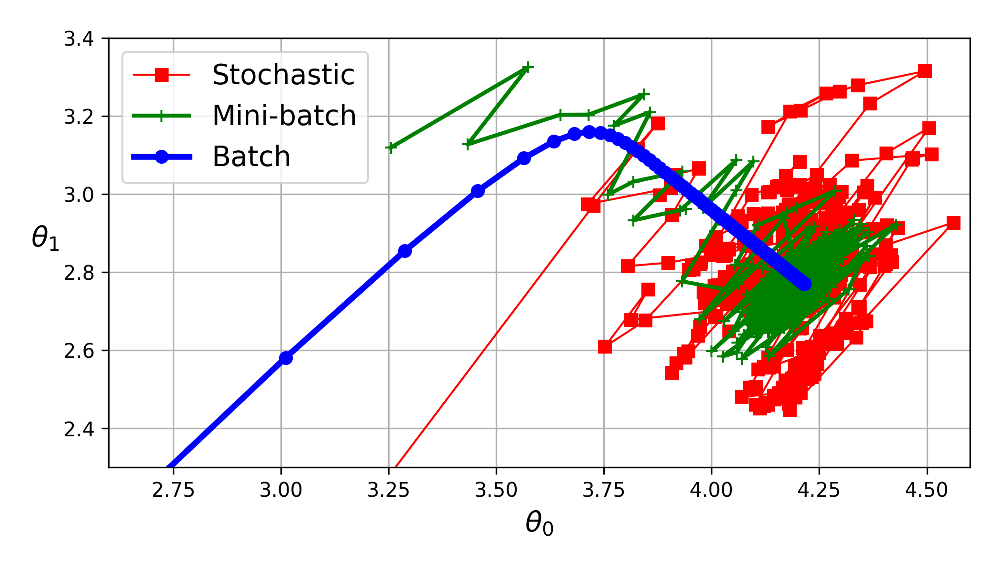

---

## 4. 다항 회귀

선형 모델은 입력 특성에 대해서는 선형이지만, 다항 특성을 추가하면 비선형 관계도 학습할 수 있습니다.

실습 데이터는 다음과 같은 2차 관계에 잡음을 추가해 만들었습니다.

$$
y
=
0.5x^2+x+2+\text{noise}
$$

```python
poly_features = PolynomialFeatures(
    degree=2,
    include_bias=False
)
X_poly = poly_features.fit_transform(X)

lin_reg = LinearRegression()
lin_reg.fit(X_poly, y)
```

원래 특성이 $x$ 하나라면 변환된 데이터는 $x$와 $x^2$를 갖습니다. 이렇게 확장된 특성에 선형 회귀를 적용하면 원래 입력 공간에서는 곡선 형태의 예측을 만들 수 있습니다.

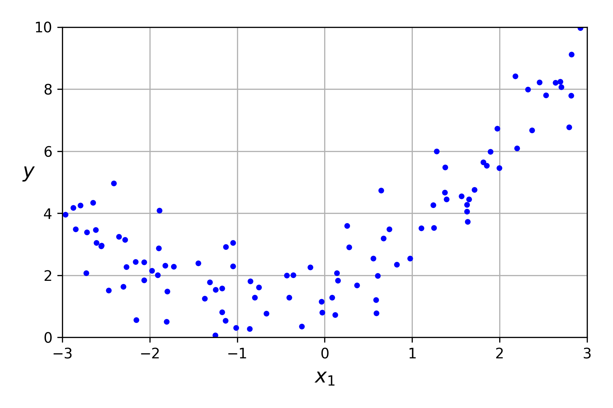

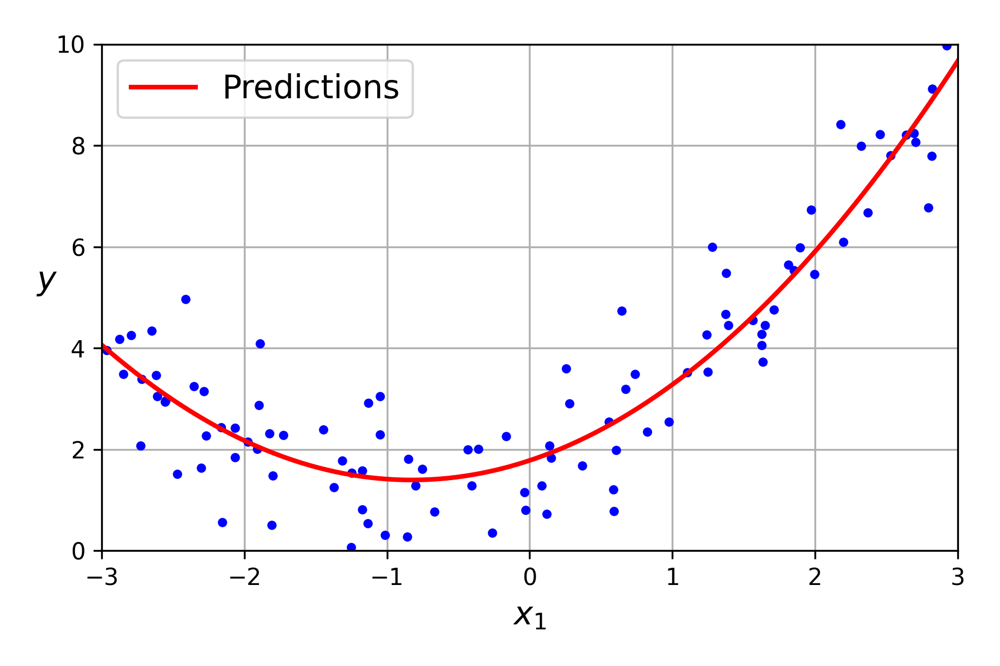

차수가 지나치게 높으면 훈련 데이터의 잡음까지 따라가며 과대적합할 수 있습니다. 실습에서는 1차, 2차, 300차 모델을 비교했습니다.

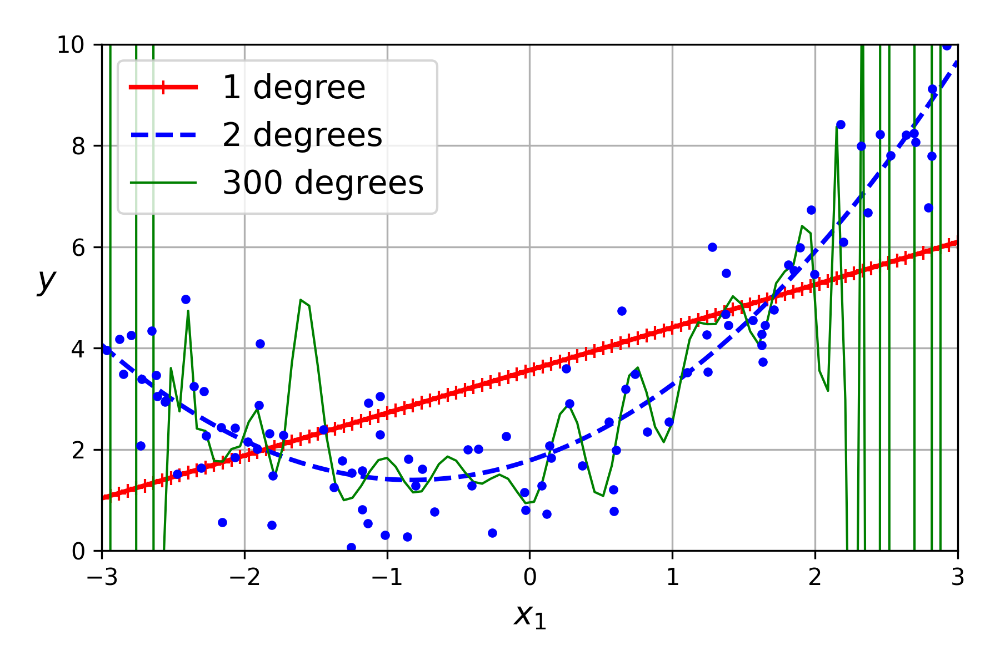

---

## 5. 학습 곡선

학습 곡선은 훈련 세트 크기를 늘려 가며 훈련 오차와 검증 오차를 측정한 그래프입니다.

```python
train_sizes, train_scores, valid_scores = learning_curve(
    LinearRegression(),
    X,
    y,
    train_sizes=np.linspace(0.01, 1.0, 40),
    cv=5,
    scoring="neg_root_mean_squared_error"
)
```

### 5.1 과소적합

선형 회귀 모델을 비선형 데이터에 적용하면 다음 특징이 나타납니다.

- 훈련 오차와 검증 오차가 모두 비교적 큼
- 두 곡선이 비슷한 값에 수렴함
- 훈련 샘플을 더 추가해도 성능이 크게 좋아지지 않음

이는 모델이 데이터의 구조를 충분히 표현하지 못하는 **과소적합** 상태입니다.

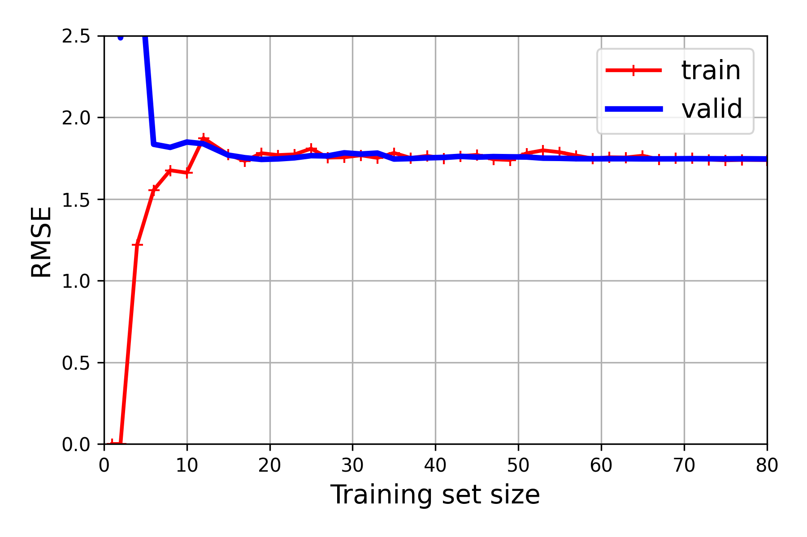

### 5.2 과대적합

같은 데이터에 10차 다항 회귀를 적용하면 다음 특징이 나타납니다.

- 훈련 오차가 매우 낮음
- 검증 오차는 훈련 오차보다 큼
- 두 곡선 사이에 간격이 존재함

이는 훈련 데이터에는 잘 맞지만 새로운 데이터에 대한 일반화 성능이 부족한 **과대적합** 상태입니다. 더 많은 훈련 데이터를 사용하거나 모델을 규제하면 두 곡선의 간격을 줄일 수 있습니다.

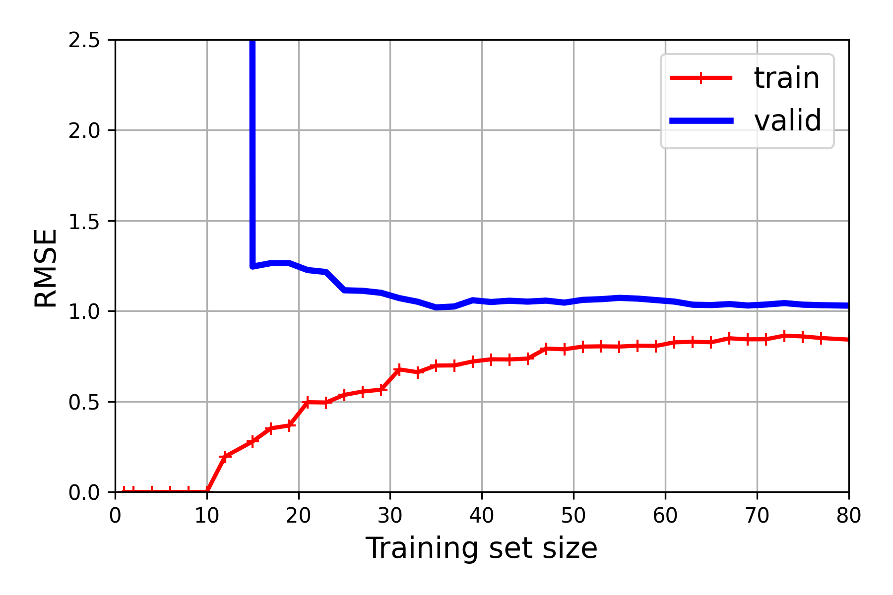

| 상태 | 훈련 오차 | 검증 오차 | 두 곡선의 관계 | 주요 해결 방법 |
|---|---:|---:|---|---|
| 과소적합 | 큼 | 큼 | 서로 가까움 | 더 복잡한 모델, 더 좋은 특성 |
| 과대적합 | 작음 | 큼 | 간격이 큼 | 규제, 더 많은 데이터, 모델 단순화 |
| 적절한 적합 | 작음 | 작음 | 서로 가까움 | 현재 복잡도 유지 및 검증 |

---

## 6. 규제가 있는 선형 모델

규제는 모델 파라미터의 크기를 제한해 과대적합을 줄입니다. 편향 $\theta_0$은 일반적으로 규제하지 않습니다.

### 6.1 릿지 회귀

릿지 회귀는 MSE에 가중치의 $\ell_2$ 노름 제곱을 추가합니다.

$$
J(\boldsymbol{\theta})
=
\operatorname{MSE}(\boldsymbol{\theta})
+
\frac{\alpha}{m}
\sum_{i=1}^{n}\theta_i^2
$$

- $\alpha=0$: 일반 선형 회귀와 같음
- $\alpha$ 증가: 가중치가 더 작아지고 모델이 평평해짐
- 장점: 모든 특성을 유지하면서 모델의 분산을 줄이는 데 유용함

릿지 회귀의 닫힌 형태 해는 다음과 같습니다.

$$
\hat{\boldsymbol{\theta}}
=
\left(
\mathbf{X}^{\top}\mathbf{X}
+\alpha\mathbf{A}
\right)^{-1}
\mathbf{X}^{\top}\mathbf{y}
$$

$\mathbf{A}$는 $(n+1)\times(n+1)$ 단위행렬에서 편향에 대응하는 왼쪽 위 원소만 0으로 바꾼 행렬입니다.

```python
ridge_reg = Ridge(alpha=0.1, solver="cholesky")
ridge_reg.fit(X, y)
ridge_reg.predict([[1.5]])
```

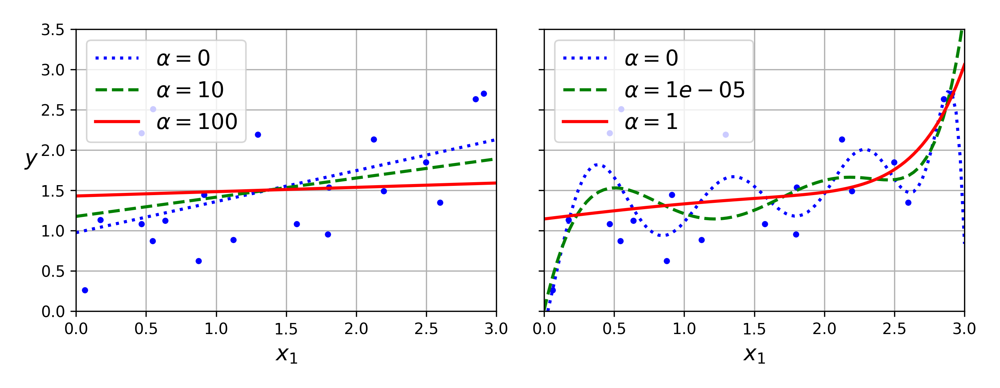

### 6.2 라쏘 회귀

라쏘 회귀는 MSE에 가중치의 $\ell_1$ 노름을 추가합니다.

$$
J(\boldsymbol{\theta})
=
\operatorname{MSE}(\boldsymbol{\theta})
+
2\alpha
\sum_{i=1}^{n}
\left|\theta_i\right|
$$

라쏘는 덜 중요한 특성의 가중치를 정확히 0으로 만들 수 있습니다. 따라서 자동으로 특성을 선택하고 0이 아닌 가중치가 적은 **희소 모델**을 만듭니다.

```python
lasso_reg = Lasso(alpha=0.1)
lasso_reg.fit(X, y)
lasso_reg.predict([[1.5]])
```

라쏘 비용 함수는 $\theta_i=0$에서 미분할 수 없습니다. 이 지점에서는 일반 그레이디언트 대신 서브그레이디언트를 사용할 수 있습니다.

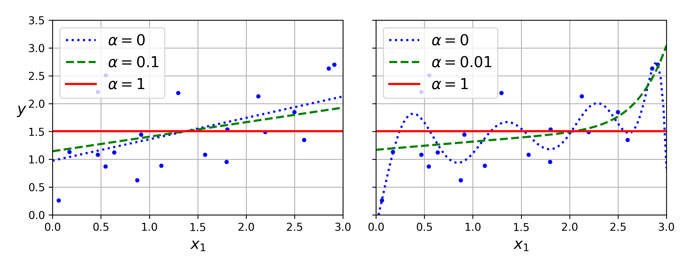

### 6.3 엘라스틱넷

엘라스틱넷은 릿지와 라쏘의 규제항을 함께 사용합니다.

$$
\begin{aligned}
J(\boldsymbol{\theta})
=
&\operatorname{MSE}(\boldsymbol{\theta}) \\
&+r
\left(
2\alpha\sum_{i=1}^{n}\left|\theta_i\right|
\right) \\
&+(1-r)
\left(
\frac{\alpha}{m}\sum_{i=1}^{n}\theta_i^2
\right)
\end{aligned}
$$

- $r=0$: 릿지 회귀와 같음
- $r=1$: 라쏘 회귀와 같음
- $0<r<1$: 두 규제를 혼합함

```python
elastic_net = ElasticNet(
    alpha=0.01,
    l1_ratio=0.5
)
elastic_net.fit(X, y)
```

### 6.4 규제 모델 선택

| 모델 | 규제 | 특징 | 적합한 상황 |
|---|---|---|---|
| 선형 회귀 | 없음 | 가장 단순하지만 과대적합 가능 | 기준 모델 |
| 릿지 | $\ell_2$ | 모든 가중치를 작게 유지 | 일반적인 기본 선택 |
| 라쏘 | $\ell_1$ | 일부 가중치를 0으로 만듦 | 유용한 특성이 적다고 예상될 때 |
| 엘라스틱넷 | $\ell_1+\ell_2$ | 희소성과 안정성을 함께 추구 | 특성이 많거나 서로 강하게 연관될 때 |

---

## 7. 조기 종료

조기 종료는 반복 학습 중 검증 오차가 최솟값에 도달했을 때 훈련을 멈추는 규제 방법입니다.

실습에서는 90차 다항 특성을 만들고 `SGDRegressor`를 한 에포크씩 학습하면서 훈련 RMSE와 검증 RMSE를 기록했습니다.

```python
best_valid_rmse = float("inf")

for epoch in range(n_epochs):
    sgd_reg.partial_fit(X_train_prep, y_train)

    y_valid_predict = sgd_reg.predict(X_valid_prep)
    valid_error = mean_squared_error(
        y_valid,
        y_valid_predict,
        squared=False
    )

    if valid_error < best_valid_rmse:
        best_valid_rmse = valid_error
        best_model = deepcopy(sgd_reg)
```

검증 오차가 다시 증가하는 시점부터 모델이 훈련 데이터에 과대적합되기 시작했다고 볼 수 있습니다.

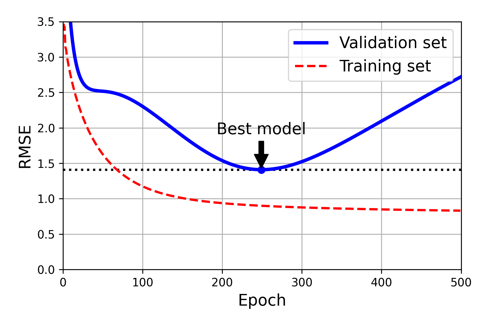

---

## 8. 로지스틱 회귀

로지스틱 회귀는 이름과 달리 주로 분류에 사용합니다. 샘플이 양성 클래스에 속할 확률을 추정합니다.

### 8.1 확률 추정

먼저 입력 특성의 가중치 합을 계산하고 로지스틱 함수에 통과시킵니다.

$$
\hat{p}
=
h_{\boldsymbol{\theta}}(\mathbf{x})
=
\sigma
\left(
\boldsymbol{\theta}^{\top}\mathbf{x}
\right)
$$

$$
\sigma(t)
=
\frac{1}{1+\exp(-t)}
$$

로지스틱 함수의 출력은 항상 0과 1 사이입니다.

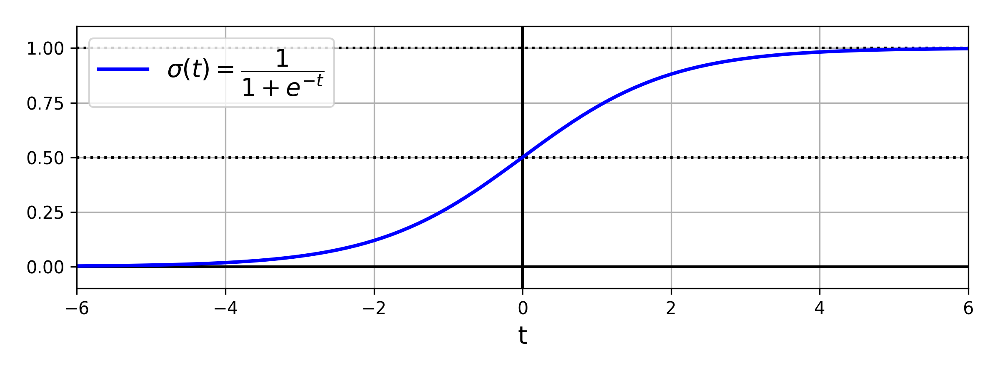

### 8.2 클래스 예측

기본 임곗값 0.5를 사용하면 다음과 같이 예측합니다.

$$
\hat{y}
=
\begin{cases}
0 & \hat{p}<0.5 \\
1 & \hat{p}\geq0.5
\end{cases}
$$

$\sigma(t)\geq0.5$와 $t\geq0$은 동치이므로 결정 경계는 $\boldsymbol{\theta}^{\top}\mathbf{x}=0$인 지점입니다.

### 8.3 로그 손실

하나의 훈련 샘플에 대한 비용 함수는 다음과 같습니다.

$$
c(\boldsymbol{\theta})
=
\begin{cases}
-\log(\hat{p}) & y=1 \\
-\log(1-\hat{p}) & y=0
\end{cases}
$$

전체 훈련 세트에 대한 로그 손실은 각 샘플의 비용을 평균한 값입니다.

$$
J(\boldsymbol{\theta})
=
-\frac{1}{m}
\sum_{i=1}^{m}
\left[
y^{(i)}
\log\left(\hat{p}^{(i)}\right)
+
\left(1-y^{(i)}\right)
\log\left(1-\hat{p}^{(i)}\right)
\right]
$$

로그 손실은 볼록 함수이므로 경사 하강법으로 전역 최솟값을 찾을 수 있습니다.

$$
\frac{\partial}{\partial\theta_j}
J(\boldsymbol{\theta})
=
\frac{1}{m}
\sum_{i=1}^{m}
\left(
\sigma
\left(
\boldsymbol{\theta}^{\top}
\mathbf{x}^{(i)}
\right)
-y^{(i)}
\right)
x_j^{(i)}
$$

### 8.4 붓꽃 이진 분류 실습

실습에서는 꽃잎 너비를 이용해 붓꽃이 `Iris virginica`인지 예측했습니다.

```python
X = iris.data[["petal width (cm)"]].values
y = iris.target_names[iris.target] == "virginica"

X_train, X_test, y_train, y_test = train_test_split(
    X,
    y,
    random_state=42
)

log_reg = LogisticRegression(random_state=42)
log_reg.fit(X_train, y_train)
```

`predict_proba()`는 각 클래스의 추정 확률을 반환합니다. 두 확률이 같아지는 지점이 결정 경계입니다.

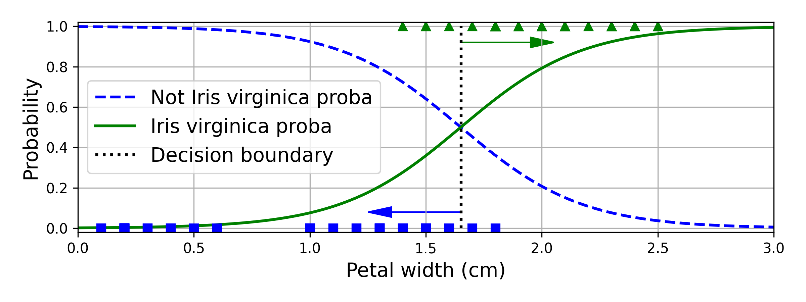

꽃잎 길이와 너비 두 특성을 사용하면 2차원 공간에서 선형 결정 경계를 확인할 수 있습니다.

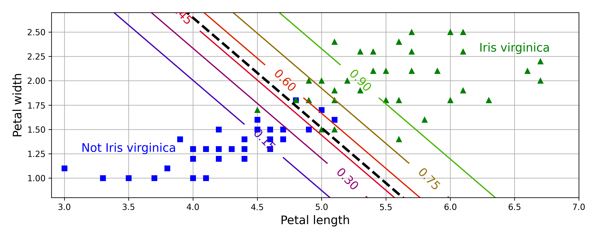

---

## 9. 소프트맥스 회귀

소프트맥스 회귀는 여러 이진 분류기를 별도로 결합하지 않고 하나의 모델로 여러 클래스를 직접 분류합니다.

### 9.1 클래스별 점수

각 클래스 $k$는 자체 파라미터 벡터 $\boldsymbol{\theta}^{(k)}$를 가집니다.

$$
s_k(\mathbf{x})
=
\left(
\boldsymbol{\theta}^{(k)}
\right)^{\top}
\mathbf{x}
$$

### 9.2 소프트맥스 함수

클래스별 점수를 지수 함수에 통과시키고 전체 합으로 나누어 확률 분포를 만듭니다.

$$
\hat{p}_k
=
\sigma
\left(
\mathbf{s}(\mathbf{x})
\right)_k
=
\frac{
\exp\left(s_k(\mathbf{x})\right)
}{
\sum_{j=1}^{K}
\exp\left(s_j(\mathbf{x})\right)
}
$$

모델은 추정 확률이 가장 높은 클래스를 선택합니다.

$$
\hat{y}
=
\underset{k}{\operatorname{argmax}}
\;
\hat{p}_k
=
\underset{k}{\operatorname{argmax}}
\;
s_k(\mathbf{x})
$$

### 9.3 크로스 엔트로피

소프트맥스 회귀는 크로스 엔트로피 비용 함수를 최소화합니다.

$$
J(\boldsymbol{\Theta})
=
-\frac{1}{m}
\sum_{i=1}^{m}
\sum_{k=1}^{K}
y_k^{(i)}
\log
\left(
\hat{p}_k^{(i)}
\right)
$$

클래스 $k$의 파라미터 벡터에 대한 그레이디언트는 다음과 같습니다.

$$
\nabla_{\boldsymbol{\theta}^{(k)}}
J(\boldsymbol{\Theta})
=
\frac{1}{m}
\sum_{i=1}^{m}
\left(
\hat{p}_k^{(i)}-y_k^{(i)}
\right)
\mathbf{x}^{(i)}
$$

### 9.4 붓꽃 다중 분류 실습

꽃잎 길이와 너비로 세 붓꽃 클래스를 직접 분류했습니다.

```python
X = iris.data[
    ["petal length (cm)", "petal width (cm)"]
].values
y = iris["target"]

softmax_reg = LogisticRegression(
    C=30,
    random_state=42
)
softmax_reg.fit(X_train, y_train)
```

사이킷런의 `LogisticRegression`은 클래스가 둘보다 많으면 소프트맥스 회귀를 사용할 수 있습니다.

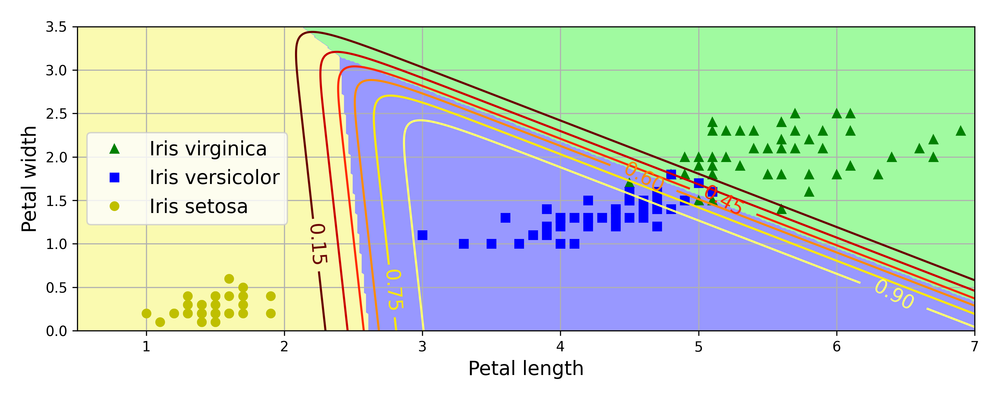

---

## 10. 실습에서 생성한 주요 시각화

| 파일 | 확인한 내용 |
|---|---|
| `generated_data_plot.png` | 잡음이 있는 선형 데이터 |
| `linear_model_predictions_plot.png` | 정규 방정식으로 구한 선형 예측 |
| `gradient_descent_plot.png` | 학습률에 따른 경사 하강법 경로 |
| `sgd_plot.png` | 확률적 경사 하강법의 불규칙한 이동 |
| `quadratic_predictions_plot.png` | 다항 특성을 사용한 비선형 예측 |
| `high_degree_polynomials_plot.png` | 차수에 따른 과소·적절·과대적합 |
| `learning_curves_plot.png` | 훈련 크기에 따른 훈련·검증 오차 |
| `ridge_regression_plot.png` | 릿지 규제 강도에 따른 모델 변화 |
| `lasso_regression_plot.png` | 라쏘 규제와 희소한 가중치 |
| `early_stopping_plot.png` | 최적 에포크 이후의 과대적합 |
| `logistic_regression_plot.png` | 이진 클래스 확률과 결정 경계 |
| `softmax_regression_contour_plot.png` | 다중 클래스 확률과 결정 영역 |

---

## 11. 알고리즘 비교

| 알고리즘 | $m$이 클 때 | 외부 메모리 학습 | $n$이 클 때 | 스케일 조정 | 사이킷런 |
|---|---|---|---|---|---|
| 정규 방정식 | 빠름 | 지원하지 않음 | 느림 | 필요하지 않음 | 직접 계산 |
| SVD | 빠름 | 지원하지 않음 | 느림 | 필요하지 않음 | `LinearRegression` |
| 배치 경사 하강법 | 느림 | 지원하지 않음 | 빠름 | 필요함 | 직접 구현 |
| 확률적 경사 하강법 | 빠름 | 지원함 | 빠름 | 필요함 | `SGDRegressor` |
| 미니배치 경사 하강법 | 빠름 | 지원함 | 빠름 | 필요함 | 직접 구현 |

---

## 12. 핵심 클래스와 함수 정리

| 도구 | 역할 |
|---|---|
| `LinearRegression` | 최소제곱 선형 회귀 |
| `np.linalg.inv` | 정방행렬의 역행렬 계산 |
| `np.linalg.pinv` | 무어–펜로즈 유사역행렬 계산 |
| `np.linalg.lstsq` | 최소제곱 해 계산 |
| `SGDRegressor` | 확률적 경사 하강법 기반 회귀 |
| `PolynomialFeatures` | 다항 특성과 특성 조합 생성 |
| `StandardScaler` | 평균 0, 표준편차 1로 특성 표준화 |
| `make_pipeline` | 전처리와 모델을 순서대로 연결 |
| `learning_curve` | 훈련 크기별 훈련·검증 점수 계산 |
| `Ridge` | $\ell_2$ 규제를 적용한 선형 회귀 |
| `Lasso` | $\ell_1$ 규제를 적용한 선형 회귀 |
| `ElasticNet` | $\ell_1$과 $\ell_2$ 규제를 혼합한 회귀 |
| `mean_squared_error` | MSE 또는 RMSE 계산 |
| `LogisticRegression` | 이진·다중 로지스틱 회귀 |
| `predict_proba` | 클래스별 추정 확률 반환 |
| `train_test_split` | 훈련 세트와 테스트 세트 분리 |

---

## 13. 실습에서 꼭 기억할 규칙

1. MSE와 RMSE는 값의 크기는 다르지만 같은 파라미터에서 최소가 됩니다.
2. 정규 방정식은 특성 수가 많아지면 계산 비용이 빠르게 증가합니다.
3. 경사 하강법을 사용하기 전에는 특성의 스케일을 맞추는 것이 중요합니다.
4. 학습률이 너무 작으면 느리고, 너무 크면 발산할 수 있습니다.
5. 확률적 경사 하강법은 학습률을 점진적으로 줄여야 안정적으로 수렴합니다.
6. 다항 회귀도 파라미터에 대해서는 여전히 선형 모델입니다.
7. 훈련 오차와 검증 오차가 모두 크면 과소적합을 의심합니다.
8. 훈련 오차만 작고 검증 오차가 크면 과대적합을 의심합니다.
9. 규제항은 훈련 비용에 사용하지만 최종 성능은 규제가 없는 평가 지표로 측정합니다.
10. 편향 $\theta_0$은 일반적으로 규제하지 않습니다.
11. 릿지는 가중치를 작게 만들고, 라쏘는 일부 가중치를 정확히 0으로 만들 수 있습니다.
12. 조기 종료 시점은 훈련 오차가 아니라 검증 오차로 결정합니다.
13. 로지스틱 회귀의 출력은 클래스 자체가 아니라 양성 클래스의 추정 확률입니다.
14. 소프트맥스 회귀는 모든 클래스의 확률 합이 1이 되도록 정규화합니다.
15. 비용 함수와 평가 지표의 첨자는 샘플 $i$와 특성 $j$를 구분해 사용해야 합니다.

---

## 14. 한 문장 요약

> 모델 훈련은 비용 함수를 최소화하는 파라미터를 찾는 과정이며, 데이터와 모델의 복잡도에 맞는 최적화 방법과 규제를 선택하고 학습 곡선으로 일반화 성능을 확인해야 합니다.
