# 5장 서포트 벡터 머신

> 서포트 벡터 머신의 핵심 아이디어부터 선형·비선형 분류, 커널 트릭, SVM 회귀, 최적화 이론까지 학습한 내용을 개념 정리와 복습 목적으로 정리한 노트입니다.
>
> 실습 노트북: [05_support_vector_machines.ipynb](./05_support_vector_machines.ipynb)

## 1. 학습 목표

이 장의 목표는 SVM이 단순히 분류선을 찾는 모델이 아니라, **일반화에 유리한 가장 넓은 마진을 찾는 모델**이라는 점을 이해하는 것입니다.

- 결정 경계, 마진, 서포트 벡터의 관계를 설명합니다.
- 하드 마진과 소프트 마진의 차이를 이해합니다.
- 규제 하이퍼파라미터 `C`가 모델에 미치는 영향을 설명합니다.
- 특성 스케일이 SVM에 중요한 이유를 이해합니다.
- 다항 특성과 커널 트릭으로 비선형 데이터를 분류합니다.
- RBF 커널의 `gamma`와 `C`를 함께 조절합니다.
- `LinearSVC`, `SVC`, `SGDClassifier`를 상황에 맞게 선택합니다.
- `LinearSVR`과 `SVR`로 선형·비선형 회귀를 수행합니다.
- SVM의 원 문제, 쌍대 문제, 힌지 손실을 개념적으로 이해합니다.

전체 흐름은 다음과 같습니다.

```text
선형 SVM과 최대 마진
  -> 소프트 마진과 C
  -> 비선형 특성 변환
  -> 커널 트릭
  -> 다항식·RBF 커널
  -> SVM 회귀
  -> 최적화 문제와 힌지 손실
  -> 모델 선택과 튜닝
```

---

## 2. SVM의 핵심 아이디어

### 2.1 라지 마진 분류

이진 분류 문제에서는 여러 개의 결정 경계가 두 클래스를 나눌 수 있습니다. SVM은 그중에서 두 클래스와 결정 경계 사이의 여유 공간인 **마진(margin)** 이 가장 넓은 경계를 선택합니다.

결정 경계 주변의 넓은 공간을 도로라고 생각하면 다음과 같습니다.

- 도로의 중앙선: 결정 경계
- 도로의 양쪽 경계: 마진 경계
- 도로 경계에 가장 가까운 샘플: 서포트 벡터
- 도로의 폭을 최대화하는 분류: 라지 마진 분류

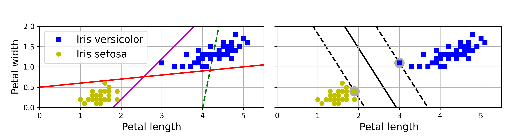

훈련 샘플을 무조건 정확히 나누는 것보다 마진을 넓히는 이유는 새로운 샘플에 대한 **일반화 성능**을 높이기 위해서입니다.

### 2.2 서포트 벡터

**서포트 벡터(support vector)** 는 결정 경계에 가장 가까워 마진의 위치와 폭을 결정하는 훈련 샘플입니다.

마진에서 멀리 떨어진 샘플은 추가하거나 제거해도 결정 경계에 거의 영향을 주지 않습니다. 반면 서포트 벡터가 이동하면 결정 경계도 바뀔 수 있습니다. 즉, SVM의 해는 전체 샘플보다 경계 근처의 중요한 샘플에 의해 결정됩니다.

### 2.3 특성 스케일의 중요성

SVM은 특성 공간의 거리와 점곱을 사용하므로 특성마다 스케일이 다르면 큰 값을 가진 특성이 결정 경계를 지배합니다.

예를 들어 한 특성의 범위가 1~5이고 다른 특성의 범위가 1~100이면, 두 번째 특성 방향의 거리가 과도하게 크게 반영됩니다. 그러면 마진이 한쪽으로 치우치고 학습도 어려워집니다.

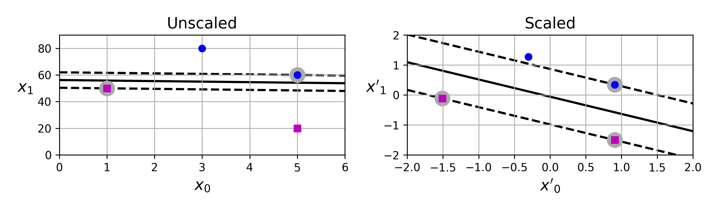

따라서 SVM은 일반적으로 `StandardScaler`와 파이프라인으로 묶어 사용합니다.

```python
from sklearn.pipeline import make_pipeline
from sklearn.preprocessing import StandardScaler
from sklearn.svm import LinearSVC

svm_clf = make_pipeline(
    StandardScaler(),
    LinearSVC(C=1, dual=True, random_state=42)
)
svm_clf.fit(X_train, y_train)
```

> 스케일러는 훈련 데이터로만 `fit()`해야 합니다. 파이프라인과 교차 검증을 함께 사용하면 데이터 누수를 방지할 수 있습니다.

---

## 3. 하드 마진과 소프트 마진

### 3.1 하드 마진 분류

**하드 마진 분류(hard margin classification)** 는 모든 훈련 샘플이 마진 바깥쪽에서 올바르게 분류되도록 강제합니다.

하드 마진에는 두 가지 큰 문제가 있습니다.

1. 데이터가 완벽하게 선형 분리 가능해야 합니다.
2. 이상치 하나에도 결정 경계가 크게 변할 수 있습니다.

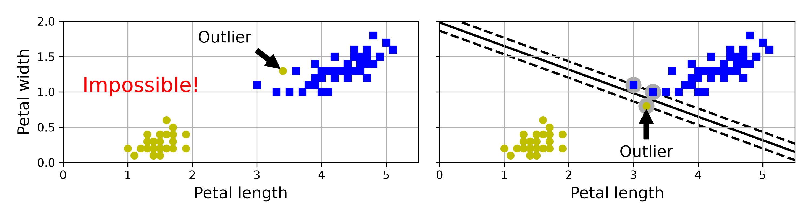

현실의 데이터에는 잡음, 이상치, 겹치는 클래스가 흔하므로 하드 마진은 실전에서 제약이 큽니다.

### 3.2 소프트 마진 분류

**소프트 마진 분류(soft margin classification)** 는 다음 두 목표 사이에서 균형을 찾습니다.

- 마진을 가능한 넓게 유지하기
- 마진 안에 들어오거나 잘못 분류되는 샘플인 마진 오류를 줄이기

이 균형을 조절하는 하이퍼파라미터가 `C`입니다.

| `C` | 마진 | 마진 오류 허용 | 모델 복잡도 | 주요 위험 |
|---:|---|---|---|---|
| 작음 | 넓음 | 많이 허용 | 낮음 | 과소적합 |
| 큼 | 좁음 | 적게 허용 | 높음 | 과대적합 |

`C`는 규제 강도 자체가 아니라 **규제 강도의 역수와 같은 방향**으로 작동한다고 기억하면 좋습니다.

- 과대적합: `C`를 낮춰 규제를 강화합니다.
- 과소적합: `C`를 높여 규제를 약화합니다.

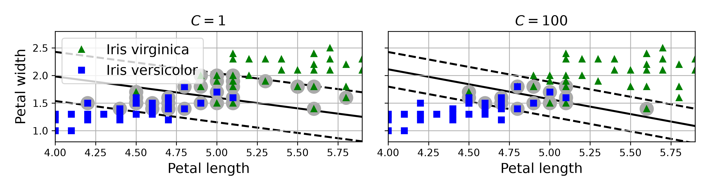

```python
from sklearn.svm import LinearSVC

linear_svm = make_pipeline(
    StandardScaler(),
    LinearSVC(C=1, max_iter=10_000, dual=True, random_state=42)
)
linear_svm.fit(X_train, y_train)
```

`decision_function()`은 각 샘플이 결정 경계의 어느 쪽에 얼마나 떨어져 있는지를 나타내는 점수를 반환합니다. 이 값은 확률이 아닙니다.

```python
scores = linear_svm.decision_function(X_new)
predictions = linear_svm.predict(X_new)
```

---

## 4. 비선형 SVM 분류

### 4.1 다항 특성 추가

원래 공간에서 선형 분리할 수 없는 데이터도 다항 특성을 추가한 고차원 공간에서는 선형 분리할 수 있습니다.

예를 들어 특성이 $x_1$ 하나일 때 $x_2=x_1^2$를 추가하면 1차원에서는 분리할 수 없던 샘플이 2차원에서는 직선으로 분리될 수 있습니다.

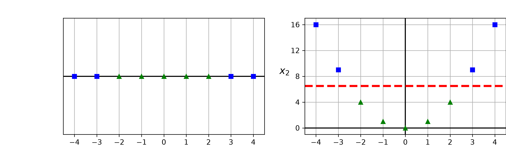

작은 차수에서는 `PolynomialFeatures`와 `LinearSVC`를 직접 연결할 수 있습니다.

```python
from sklearn.preprocessing import PolynomialFeatures

polynomial_svm_clf = make_pipeline(
    PolynomialFeatures(degree=3),
    StandardScaler(),
    LinearSVC(C=10, max_iter=10_000, dual=True, random_state=42)
)
polynomial_svm_clf.fit(X_train, y_train)
```

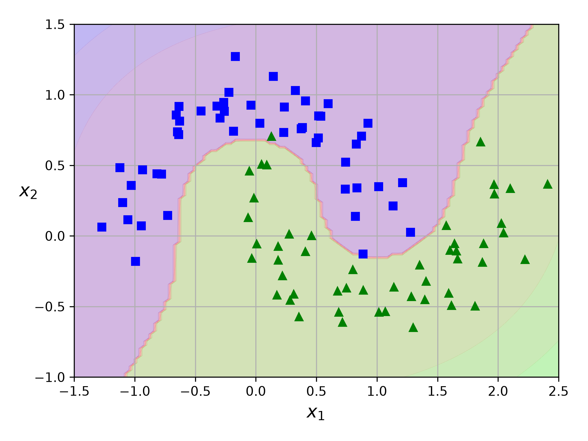

하지만 차수가 커지면 생성되는 특성 수가 빠르게 증가해 계산량과 메모리 사용량이 커집니다.

### 4.2 커널 트릭

**커널 트릭(kernel trick)** 은 데이터를 실제로 고차원 공간으로 변환하지 않고, 변환된 공간에서 두 벡터의 점곱을 계산한 것과 같은 결과를 얻는 방법입니다.

즉, 다음 변환을 직접 계산하지 않습니다.

$$
\mathbf{x}
\xrightarrow{\phi}
\phi(\mathbf{x})
$$

대신 커널 함수로 변환된 두 벡터의 점곱을 바로 계산합니다.

$$
K(\mathbf{a},\mathbf{b})
=
\phi(\mathbf{a})^{\top}\phi(\mathbf{b})
$$

이 덕분에 매우 높거나 무한한 차원의 특성 공간도 효율적으로 이용할 수 있습니다.

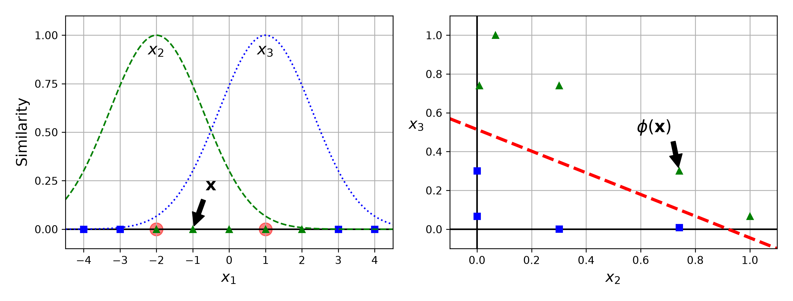

---

## 5. 주요 커널

### 5.1 선형 커널

$$
K(\mathbf{a},\mathbf{b})
=
\mathbf{a}^{\top}\mathbf{b}
$$

특성 수가 많거나 데이터가 거의 선형으로 분리될 때 적합합니다. 특히 텍스트처럼 고차원 희소 데이터에서는 선형 모델을 먼저 시도하는 것이 좋습니다.

### 5.2 다항식 커널

$$
K(\mathbf{a},\mathbf{b})
=
\left(
\gamma\mathbf{a}^{\top}\mathbf{b}+r
\right)^d
$$

사이킷런에서는 `degree`가 $d$, `coef0`가 $r$에 해당합니다.

```python
from sklearn.svm import SVC

poly_kernel_svm_clf = make_pipeline(
    StandardScaler(),
    SVC(kernel="poly", degree=3, coef0=1, C=5)
)
poly_kernel_svm_clf.fit(X_train, y_train)
```

- `degree` 증가: 더 복잡한 결정 경계를 만들 수 있습니다.
- `coef0` 증가: 높은 차수 항과 낮은 차수 항의 영향 균형이 달라집니다.
- `C` 증가: 마진 오류를 더 강하게 벌점화합니다.

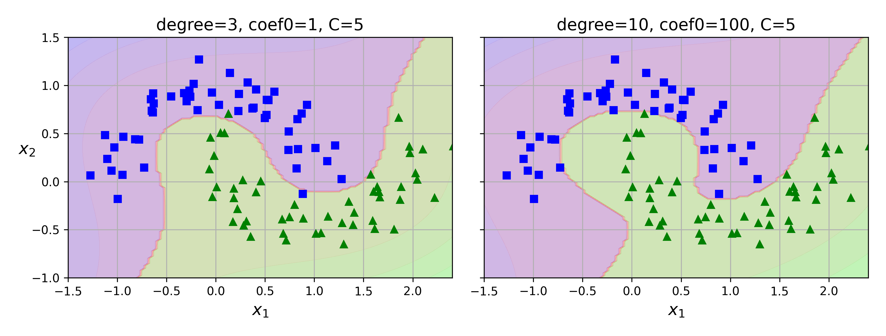

### 5.3 가우스 RBF 커널

RBF 커널은 두 샘플 사이의 거리에 따라 유사도를 계산합니다.

$$
K(\mathbf{a},\mathbf{b})
=
\exp\left(
-\gamma
\lVert\mathbf{a}-\mathbf{b}\rVert^2
\right)
$$

`gamma`는 한 훈련 샘플이 영향을 미치는 범위를 결정합니다.

| `gamma` | 샘플의 영향 범위 | 결정 경계 | 주요 위험 |
|---:|---|---|---|
| 작음 | 넓음 | 부드럽고 단순함 | 과소적합 |
| 큼 | 좁음 | 구불구불하고 복잡함 | 과대적합 |

```python
rbf_kernel_svm_clf = make_pipeline(
    StandardScaler(),
    SVC(kernel="rbf", gamma=5, C=1)
)
rbf_kernel_svm_clf.fit(X_train, y_train)
```

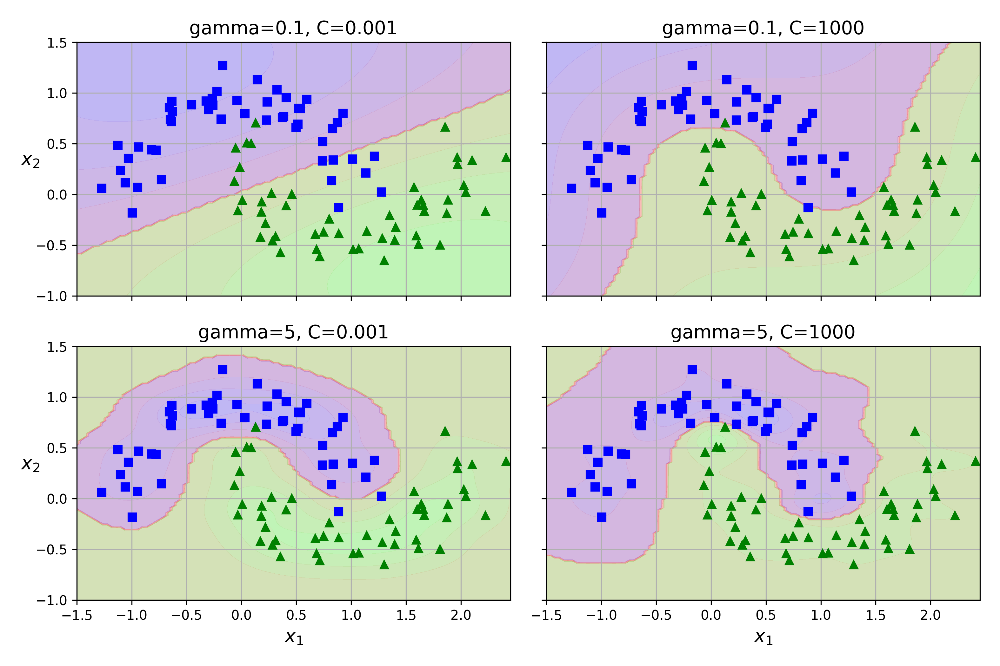

`C`와 `gamma`는 모두 모델 복잡도에 영향을 주지만 역할은 다릅니다.

- `C`: 마진 오류에 부과할 벌점의 크기
- `gamma`: 각 샘플의 영향 범위
- 과대적합: 일반적으로 `C`와 `gamma`를 낮추는 방향을 탐색
- 과소적합: 일반적으로 `C`와 `gamma`를 높이는 방향을 탐색

한 번에 하나씩 고정해서 해석할 수는 있지만 최종 값은 교차 검증으로 함께 탐색해야 합니다.

---

## 6. SVM 분류기 선택

| 클래스 | 주요 용도 | 커널 트릭 | 대규모 데이터 | 온라인 학습 | 다중 분류 기본 전략 |
|---|---|---|---|---|---|
| `LinearSVC` | 선형 분류 | 지원하지 않음 | 비교적 적합 | 지원하지 않음 | OvR |
| `SVC` | 중소규모 비선형 분류 | 지원함 | 샘플이 많으면 느림 | 지원하지 않음 | OvO |
| `SGDClassifier(loss="hinge")` | 매우 큰 선형 분류 | 지원하지 않음 | 적합 | `partial_fit()` 지원 | OvR |

일반적인 선택 순서는 다음과 같습니다.

1. 먼저 스케일을 조정한 선형 모델을 기준 모델로 만듭니다.
2. 샘플 수가 매우 많으면 `SGDClassifier(loss="hinge")`를 고려합니다.
3. 선형 모델이 과소적합하고 데이터가 중소규모이면 RBF `SVC`를 시도합니다.
4. 도메인상 다항 관계가 예상되면 다항식 커널을 비교합니다.

`SVC`의 훈련 시간은 샘플 수가 증가할 때 대략 $O(m^2n)$과 $O(m^3n)$ 사이로 빠르게 늘어날 수 있습니다. 반면 `LinearSVC`와 `SGDClassifier`는 선형 문제에 특화되어 더 큰 데이터셋에 적합합니다.

### 6.1 확률이 필요한 경우

`decision_function()`의 출력은 신뢰 점수처럼 활용할 수 있지만 확률은 아닙니다. `SVC(probability=True)`를 사용하면 `predict_proba()`를 제공하지만, 내부 확률 보정 때문에 훈련이 더 느려집니다.

정확한 확률 품질이 중요하다면 별도의 검증 데이터를 사용하는 `CalibratedClassifierCV`도 고려합니다.

---

## 7. SVM 회귀

### 7.1 기본 아이디어

SVM 분류는 마진 안의 샘플을 줄이려 하지만, **SVM 회귀**는 반대로 예측선 주변의 일정한 폭 안에 가능한 많은 샘플이 들어오게 합니다.

이 폭은 `epsilon`으로 조절합니다.

- 예측선에서 오차가 $\epsilon$ 이하인 샘플: 손실 0
- 오차가 $\epsilon$을 넘는 샘플: 초과한 만큼 손실 발생
- `epsilon` 증가: 허용 오차 영역이 넓어지고 서포트 벡터가 줄어드는 경향
- `epsilon` 감소: 허용 오차 영역이 좁아지고 서포트 벡터가 늘어나는 경향

마진 안의 샘플 변화에는 손실이 반응하지 않으므로 **$\epsilon$-비민감($\epsilon$-insensitive)** 이라고 합니다.

### 7.2 선형 SVM 회귀

```python
from sklearn.svm import LinearSVR

svm_reg = make_pipeline(
    StandardScaler(),
    LinearSVR(epsilon=0.5, dual=True, random_state=42)
)
svm_reg.fit(X_train, y_train)
```

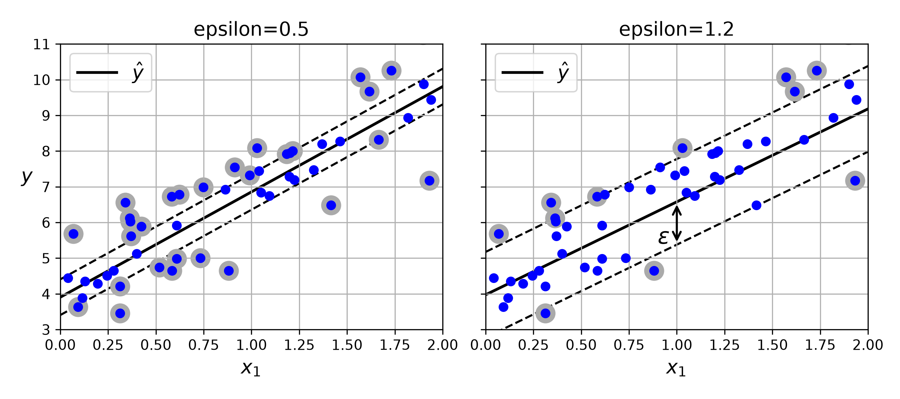

### 7.3 비선형 SVM 회귀

비선형 관계에는 `SVR`과 커널을 사용합니다.

```python
from sklearn.svm import SVR

svm_poly_reg = make_pipeline(
    StandardScaler(),
    SVR(kernel="poly", degree=2, C=10, epsilon=0.1)
)
svm_poly_reg.fit(X_train, y_train)
```

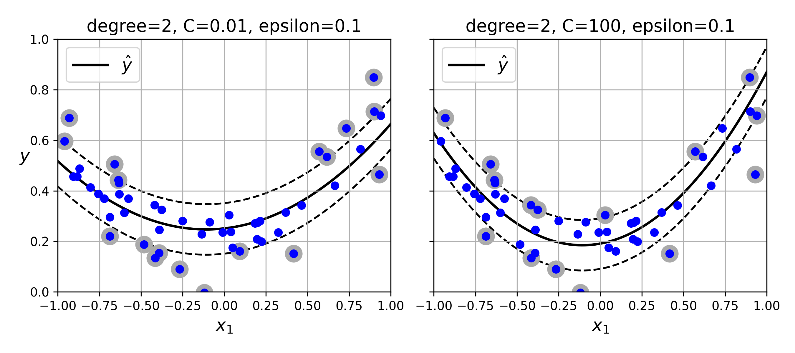

회귀에서도 `C`가 크면 마진 밖의 오차에 더 큰 벌점을 부과해 훈련 데이터에 민감한 모델이 됩니다. `SVR`은 비선형 관계를 잘 표현할 수 있지만 샘플 수가 커지면 `SVC`처럼 훈련이 느려집니다.

---

## 8. SVM 이론

### 8.1 결정 함수와 예측

선형 SVM의 결정 함수는 다음과 같습니다.

$$
s(\mathbf{x})
=
\mathbf{w}^{\top}\mathbf{x}+b
$$

이진 분류에서는 점수의 부호로 클래스를 예측합니다.

$$
\hat{y}
=
\begin{cases}
0 & s(\mathbf{x})<0 \\
1 & s(\mathbf{x})\geq0
\end{cases}
$$

결정 경계는 $s(\mathbf{x})=0$, 두 마진 경계는 $s(\mathbf{x})=-1$과 $s(\mathbf{x})=1$입니다. 마진의 전체 폭은 $2/\lVert\mathbf{w}\rVert$이므로 $\mathbf{w}$의 크기를 줄일수록 마진이 넓어집니다.

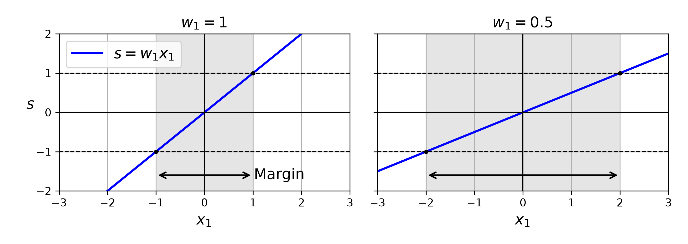

### 8.2 하드 마진 목적 함수

레이블을 $t^{(i)}\in\{-1,1\}$로 표현하면 모든 샘플이 올바른 마진 바깥에 있어야 한다는 제약은 다음과 같습니다.

$$
t^{(i)}
\left(
\mathbf{w}^{\top}\mathbf{x}^{(i)}+b
\right)
\geq1
$$

하드 마진 SVM의 최적화 문제는 다음과 같습니다.

$$
\underset{\mathbf{w},b}{\operatorname{minimize}}
\quad
\frac{1}{2}\mathbf{w}^{\top}\mathbf{w}
$$

$$
\text{subject to}
\quad
t^{(i)}
\left(
\mathbf{w}^{\top}\mathbf{x}^{(i)}+b
\right)
\geq1
\quad(i=1,\ldots,m)
$$

### 8.3 소프트 마진 목적 함수

소프트 마진은 각 샘플의 마진 위반 정도를 나타내는 슬랙 변수 $\zeta^{(i)}\geq0$을 도입합니다.

$$
\underset{\mathbf{w},b,\boldsymbol{\zeta}}{\operatorname{minimize}}
\quad
\frac{1}{2}\mathbf{w}^{\top}\mathbf{w}
+
C\sum_{i=1}^{m}\zeta^{(i)}
$$

$$
\text{subject to}
\quad
t^{(i)}
\left(
\mathbf{w}^{\top}\mathbf{x}^{(i)}+b
\right)
\geq1-\zeta^{(i)},
\quad
\zeta^{(i)}\geq0
$$

첫 번째 항은 마진을 넓히고, 두 번째 항은 마진 위반을 줄입니다. `C`가 두 목표의 균형을 결정합니다.

### 8.4 힌지 손실

힌지 손실은 샘플이 올바른 마진 바깥에 있으면 0이고, 마진을 침범하거나 잘못 분류될수록 선형으로 증가합니다.

$$
\ell(t,s)
=
\max(0,1-ts)
$$

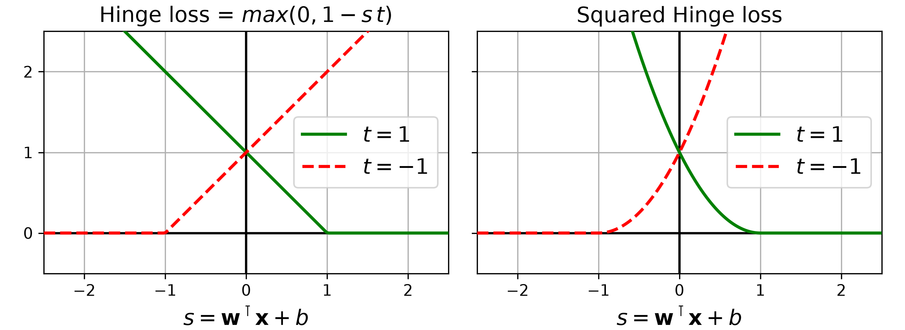

- 힌지 손실: 마진 위반에 선형 벌점
- 제곱 힌지 손실: 큰 위반에 더 강한 벌점
- `LinearSVC` 기본값: `loss="squared_hinge"`
- `SGDClassifier(loss="hinge")`: 선형 SVM과 유사한 목적 함수

### 8.5 쌍대 문제와 서포트 벡터

SVM의 원 문제(primal problem)는 가중치 $\mathbf{w}$를 직접 구합니다. 쌍대 문제(dual problem)는 각 훈련 샘플에 대응하는 계수 $\alpha^{(i)}$를 구합니다.

쌍대 문제를 풀면 가중치는 다음처럼 표현됩니다.

$$
\hat{\mathbf{w}}
=
\sum_{i=1}^{m}
\hat{\alpha}^{(i)}t^{(i)}\mathbf{x}^{(i)}
$$

$\hat{\alpha}^{(i)}>0$인 샘플만 최종 결정 함수에 기여하며, 이 샘플들이 바로 서포트 벡터입니다. 쌍대 문제는 훈련 샘플 사이의 점곱으로 표현되므로 점곱을 커널 함수로 바꾸는 커널 트릭을 적용할 수 있습니다.

커널 SVM의 예측 점수는 개념적으로 다음과 같습니다.

$$
s(\mathbf{x})
=
\sum_{i\in SV}
\hat{\alpha}^{(i)}t^{(i)}
K\left(\mathbf{x}^{(i)},\mathbf{x}\right)
+\hat{b}
$$

전체 훈련 샘플이 아니라 서포트 벡터와 새 샘플 사이의 커널 값만 필요합니다.

---

## 9. 실전 튜닝 순서

### 9.1 분류 문제

```python
from scipy.stats import loguniform
from sklearn.model_selection import RandomizedSearchCV

svm_clf = make_pipeline(
    StandardScaler(),
    SVC(kernel="rbf")
)

param_distributions = {
    "svc__C": loguniform(1e-2, 1e3),
    "svc__gamma": loguniform(1e-4, 1e1),
}

search = RandomizedSearchCV(
    svm_clf,
    param_distributions,
    n_iter=50,
    cv=5,
    scoring="accuracy",
    random_state=42,
    n_jobs=-1,
)
search.fit(X_train, y_train)
```

튜닝할 때는 다음 순서를 지킵니다.

1. 훈련 세트와 테스트 세트를 먼저 분리합니다.
2. 전처리와 모델을 하나의 파이프라인으로 만듭니다.
3. 훈련 세트 안에서 교차 검증으로 `C`와 `gamma`를 탐색합니다.
4. 가장 좋은 모델을 선택한 뒤 테스트 세트는 마지막에 한 번 평가합니다.
5. 테스트 결과를 보고 다시 튜닝하면 테스트 세트에 과대적합될 수 있습니다.

### 9.2 회귀 문제

회귀에서는 `C`, `gamma`, `epsilon`을 함께 탐색하고 RMSE 같은 회귀 지표를 사용합니다.

```python
param_distributions = {
    "svr__C": loguniform(1e-2, 1e3),
    "svr__gamma": loguniform(1e-4, 1e1),
    "svr__epsilon": loguniform(1e-3, 1),
}
```

`C`와 `gamma`는 여러 자릿수 범위에서 최적값이 달라질 수 있으므로 균등 분포보다 로그 균등 분포로 탐색하는 것이 적합합니다.

---

## 10. 실습에서 확인한 내용

### 10.1 와인 분류

와인 데이터셋에서 스케일 조정 없이 `LinearSVC`를 사용하면 수렴 경고가 발생하고 교차 검증 정확도가 낮았습니다. 단순히 `max_iter`만 크게 늘려도 근본 문제가 해결되지 않았습니다.

`StandardScaler`를 적용한 뒤에는 수렴과 정확도가 모두 개선되었습니다. 이후 RBF `SVC`와 하이퍼파라미터 탐색을 적용해 선형 모델보다 더 좋은 후보를 찾았습니다.

핵심 교훈은 다음과 같습니다.

- 수렴 경고가 발생하면 반복 횟수만 늘리기 전에 스케일을 확인합니다.
- 작은 표 형식 데이터에서는 RBF SVM이 강력한 후보가 될 수 있습니다.
- 교차 검증 점수보다 테스트 점수가 낮은 것은 자연스러울 수 있습니다.
- 테스트 점수를 보고 반복 튜닝하지 않습니다.

### 10.2 캘리포니아 주택 회귀

`LinearSVR`를 기준 모델로 만들고 RBF `SVR`의 `C`와 `gamma`를 탐색했습니다. RBF 커널이 선형 모델보다 개선되었지만, 샘플이 20,000개 이상인 데이터셋에서는 커널 SVM의 훈련 비용이 크게 증가했습니다.

따라서 큰 데이터셋에서 커널 `SVR`를 튜닝할 때는 작은 훈련 부분집합으로 후보 범위를 먼저 좁히고, 계산 시간과 성능 개선 폭을 함께 판단해야 합니다.

---

## 11. 자주 헷갈리는 관계

| 상황 | 조절 방향 | 이유 |
|---|---|---|
| 선형 SVM 과대적합 | `C` 감소 | 마진 오류를 더 허용하고 마진을 넓힘 |
| 선형 SVM 과소적합 | `C` 증가 | 마진 오류에 더 큰 벌점을 부과함 |
| RBF SVM 과대적합 | `gamma` 감소, `C` 감소 후보 탐색 | 경계를 부드럽게 하고 규제를 강화함 |
| RBF SVM 과소적합 | `gamma` 증가, `C` 증가 후보 탐색 | 국소적인 패턴과 마진 오류를 더 강하게 반영함 |
| SVR이 지나치게 민감함 | `epsilon` 증가 또는 `C` 감소 | 허용 오차를 넓히거나 오차 벌점을 낮춤 |
| 수렴이 느리거나 경계가 치우침 | 특성 표준화 | 거리 계산에서 특성 영향력을 맞춤 |

`C`가 크면 규제가 강해진다고 오해하기 쉽지만 실제 동작은 반대입니다. `C`가 클수록 마진 위반을 강하게 벌하므로 모델이 훈련 데이터에 더 맞춰지고 규제 효과는 약해집니다.

---

## 12. 핵심 클래스와 속성

| 도구 | 역할 |
|---|---|
| `LinearSVC` | 선형 SVM 분류 |
| `SVC` | 커널을 지원하는 SVM 분류 |
| `SGDClassifier(loss="hinge")` | SGD 기반의 확장성 높은 선형 SVM 분류 |
| `LinearSVR` | 선형 SVM 회귀 |
| `SVR` | 커널을 지원하는 SVM 회귀 |
| `StandardScaler` | 특성 표준화 |
| `make_pipeline` | 전처리와 모델을 안전하게 연결 |
| `decision_function()` | 결정 경계에 대한 부호 있는 점수 반환 |
| `predict()` | 최종 클래스 또는 회귀값 예측 |
| `support_` | `SVC`와 `SVR`의 서포트 벡터 인덱스 |
| `support_vectors_` | 학습된 서포트 벡터 |
| `n_support_` | 클래스별 서포트 벡터 수 |
| `RandomizedSearchCV` | 하이퍼파라미터 조합 탐색 |

---

## 13. 실습에서 꼭 기억할 규칙

1. SVM은 클래스 사이를 나누는 선이 아니라 가장 넓은 마진을 찾습니다.
2. 결정 경계는 주로 서포트 벡터에 의해 결정됩니다.
3. SVM을 훈련하기 전에는 특성 스케일을 맞춥니다.
4. 하드 마진은 선형 분리가 가능해야 하며 이상치에 민감합니다.
5. 소프트 마진은 마진의 폭과 마진 오류 사이에서 균형을 찾습니다.
6. `C`가 작으면 규제가 강하고, `C`가 크면 규제가 약합니다.
7. 비선형 데이터에는 다항 특성이나 커널 SVM을 사용할 수 있습니다.
8. 커널 트릭은 고차원 변환을 직접 계산하지 않고 변환 공간의 점곱을 계산합니다.
9. RBF의 `gamma`가 크면 결정 경계가 복잡해지고, 작으면 부드러워집니다.
10. `C`와 `gamma`는 교차 검증으로 함께 탐색합니다.
11. `decision_function()`의 점수는 확률이 아닙니다.
12. `SVC(probability=True)`는 확률을 제공하지만 훈련 비용이 증가합니다.
13. `SVC`와 `SVR`은 샘플 수가 커지면 매우 느려질 수 있습니다.
14. 큰 선형 문제에는 `LinearSVC`, 더 큰 온라인 문제에는 `SGDClassifier`가 적합합니다.
15. SVR의 `epsilon` 안에 있는 오차에는 손실을 부과하지 않습니다.
16. 테스트 세트는 모델 선택이 끝난 뒤 최종 평가에만 사용합니다.

---

## 14. 복습 질문

1. SVM이 라지 마진 분류기라고 불리는 이유는 무엇인가요?
2. 서포트 벡터가 아닌 샘플은 왜 결정 경계에 거의 영향을 주지 않나요?
3. SVM에서 특성 스케일 조정이 중요한 이유는 무엇인가요?
4. 하드 마진 분류의 두 가지 주요 한계는 무엇인가요?
5. 소프트 마진이 동시에 최적화하려는 두 목표는 무엇인가요?
6. `C`를 낮추면 마진의 폭과 마진 오류는 각각 어떻게 변하나요?
7. 다항 특성을 직접 추가하는 방식의 단점은 무엇인가요?
8. 커널 트릭은 어떤 계산을 피하게 해 주나요?
9. RBF 커널의 `gamma`가 커지면 샘플의 영향 범위와 결정 경계는 어떻게 변하나요?
10. `C`와 `gamma`는 각각 무엇을 조절하나요?
11. `LinearSVC`, `SVC`, `SGDClassifier`는 어떤 상황에서 선택해야 하나요?
12. `decision_function()`의 결과와 예측 확률은 어떻게 다른가요?
13. SVM 회귀에서 `epsilon`은 무엇을 의미하나요?
14. 힌지 손실이 0이 되는 조건은 무엇인가요?
15. 쌍대 문제에서 커널 트릭을 적용할 수 있는 이유는 무엇인가요?
16. 수렴 경고가 발생했을 때 `max_iter`를 늘리기 전에 무엇을 확인해야 하나요?
17. 테스트 세트 결과를 보고 계속 튜닝하면 왜 문제가 되나요?

---

## 15. 한 문장 요약

> 서포트 벡터 머신은 경계에 가까운 서포트 벡터를 중심으로 최대 마진을 찾고, `C`와 커널 하이퍼파라미터로 일반화와 복잡도를 조절하는 강력한 분류·회귀 모델입니다.
