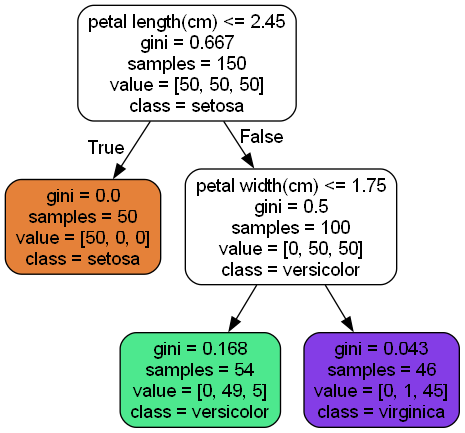
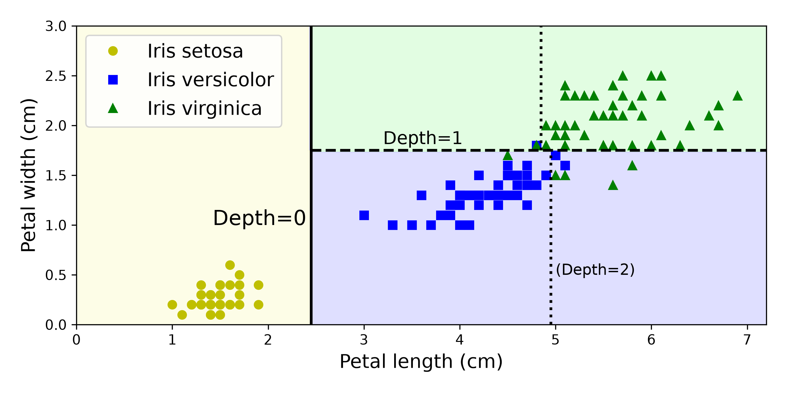
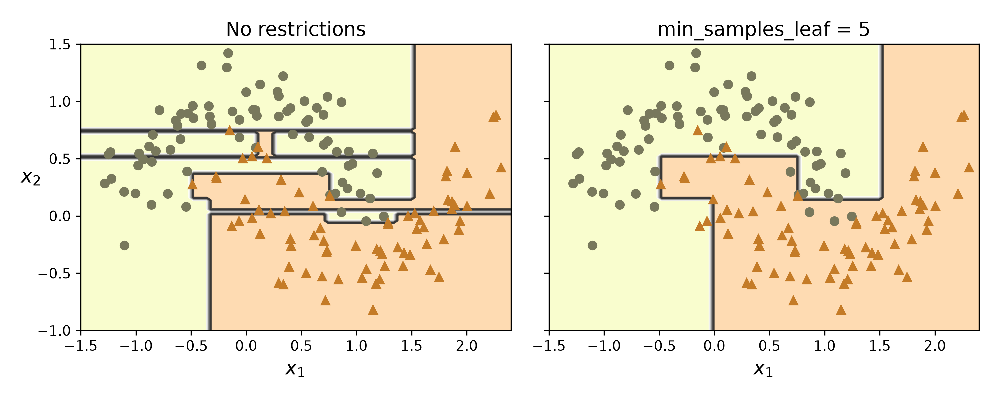
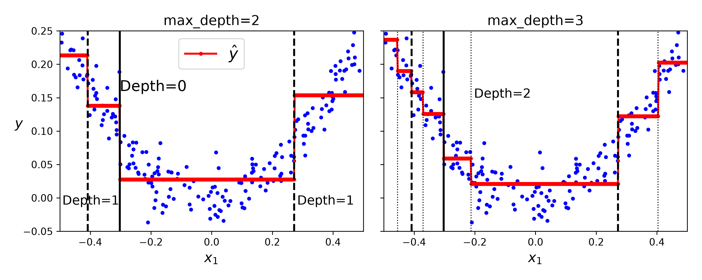
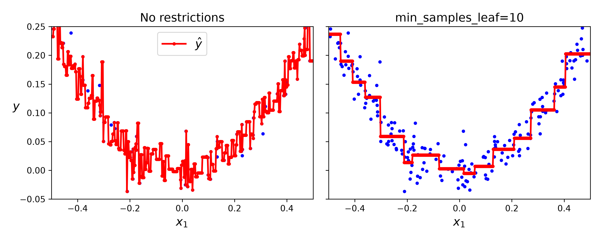
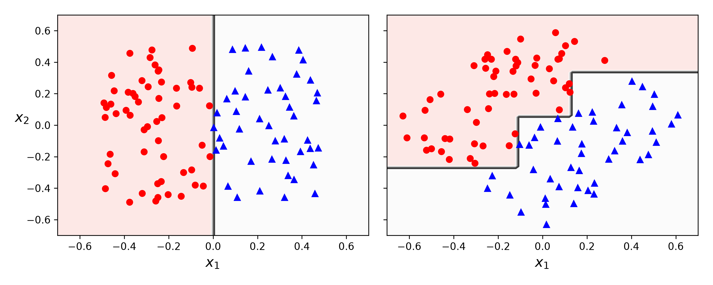
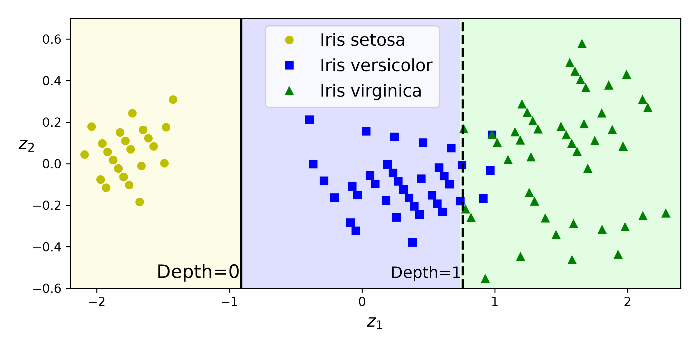
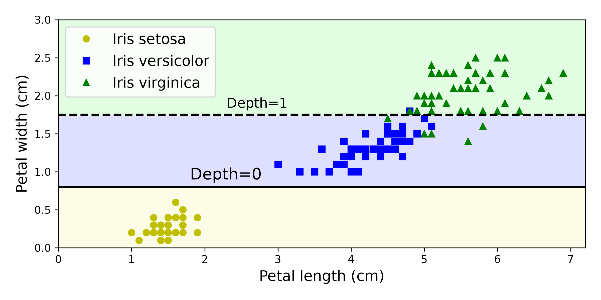

# 6장 결정 트리

> 결정 트리의 핵심 아이디어부터 분류 규칙과 클래스 확률, CART 알고리즘, 불순도, 규제, 회귀, 축 방향 민감성과 높은 분산까지 학습한 내용을 개념 정리와 복습 목적으로 정리한 노트입니다.
>
> 실습 노트북: [06_decision_trees.ipynb](./06_decision_trees.ipynb)

## 1. 학습 목표

이 장의 목표는 결정 트리가 **특성 공간을 반복해서 나누어 예측 규칙을 만드는 과정**과, 단순한 구조 뒤에 있는 과대적합 위험을 함께 이해하는 것입니다.

- 루트 노드부터 리프 노드까지 예측이 이루어지는 과정을 설명합니다.
- `samples`, `value`, `class`, `gini`가 의미하는 바를 이해합니다.
- 리프 노드의 클래스 비율로 예측 확률을 계산합니다.
- 지니 불순도와 엔트로피를 계산하고 비교합니다.
- CART 알고리즘이 좋은 특성과 임계값을 선택하는 원리를 이해합니다.
- 트리의 예측 및 훈련 시간 복잡도를 설명합니다.
- 주요 하이퍼파라미터로 트리의 성장을 제한합니다.
- `DecisionTreeRegressor`의 예측값과 MSE 기반 분할을 이해합니다.
- 결정 트리의 축 방향 민감성과 높은 분산을 설명합니다.
- PCA와 규제가 어떤 문제를 완화하는지 구분합니다.

전체 흐름은 다음과 같습니다.

```text
특성과 임계값으로 데이터 분할
  -> 트리 구조와 예측 규칙 읽기
  -> 리프 노드에서 클래스 확률 계산
  -> CART와 불순도 최소화
  -> 트리 성장 규제
  -> 회귀 트리와 MSE 분할
  -> 축 방향 민감성과 높은 분산
  -> 실전 모델 선택과 튜닝
```

---

## 2. 결정 트리의 핵심 아이디어

**결정 트리(decision tree)** 는 하나의 질문으로 전체 문제를 바로 해결하지 않습니다. 각 노드에서 `특성 <= 임계값` 형태의 질문을 던져 데이터를 둘로 나누고, 충분히 작은 집단에 도달할 때까지 같은 과정을 반복합니다.

예측 과정을 스무고개처럼 생각할 수 있습니다.

```text
루트 노드의 질문
  ├─ 참  -> 왼쪽 자식 노드의 질문
  └─ 거짓 -> 오른쪽 자식 노드의 질문
                  ...
             리프 노드의 예측
```

결정 트리는 다음 작업에 사용할 수 있습니다.

- 분류: 리프 노드에서 가장 많은 클래스를 예측합니다.
- 회귀: 기본 `squared_error` 기준에서는 리프 노드에 속한 타깃의 평균을 예측합니다.
- 다중 출력: 하나의 샘플에 대해 여러 타깃을 함께 예측할 수 있습니다.
- 비선형 문제: 여러 개의 축과 평행한 분할을 조합해 복잡한 경계를 만듭니다.

### 2.1 결정 트리의 주요 장점

- 규칙을 따라가며 예측 이유를 비교적 쉽게 해석할 수 있습니다.
- 수치 특성의 크기 순서로 임계값을 찾으므로 보통 특성 스케일 조정이 필요하지 않습니다.
- 분류와 회귀 모두에 사용할 수 있습니다.
- 비선형 관계와 특성 사이의 상호작용을 자동으로 표현할 수 있습니다.
- 예측할 때 일부 특성만 검사하므로 속도가 빠릅니다.

### 2.2 결정 트리의 주요 위험

- 제한 없이 성장하면 훈련 데이터의 작은 잡음까지 학습해 과대적합하기 쉽습니다.
- 모든 분할이 한 특성 축에 수직이므로 데이터의 회전에 민감합니다.
- 데이터나 난수 시드가 조금만 달라져도 트리 구조가 크게 바뀔 수 있습니다.
- 탐욕적으로 현재 가장 좋은 분할을 선택하므로 전체적으로 가장 좋은 트리를 보장하지 않습니다.

---

## 3. 분류 트리 훈련과 시각화

### 3.1 붓꽃 분류 트리

실습에서는 붓꽃 데이터셋의 꽃잎 길이와 너비만 사용하고, 깊이가 2인 분류 트리를 훈련했습니다.

```python
from sklearn.datasets import load_iris
from sklearn.tree import DecisionTreeClassifier

iris = load_iris(as_frame=True)
X_iris = iris.data[["petal length (cm)", "petal width (cm)"]].values
y_iris = iris.target

tree_clf = DecisionTreeClassifier(
    max_depth=2,
    random_state=42,
)
tree_clf.fit(X_iris, y_iris)
```

`max_depth=2`는 루트 노드를 깊이 0으로 보았을 때 최대 깊이 2까지만 분할하도록 제한합니다. 이 제한은 트리를 단순하게 만들고 과대적합을 줄이는 규제 역할을 합니다.

### 3.2 트리 시각화

`export_graphviz()`는 학습한 트리를 Graphviz의 `.dot` 형식으로 저장합니다.

```python
from sklearn.tree import export_graphviz

export_graphviz(
    tree_clf,
    out_file="images/decision_tree/iris_tree.dot",
    feature_names=["petal length(cm)", "petal width(cm)"],
    class_names=iris.target_names,
    rounded=True,
    filled=True,
)
```



각 노드에는 분할 조건과 현재 노드의 통계가 표시됩니다.

| 항목 | 의미 |
|---|---|
| 분할 조건 | 어떤 특성과 임계값으로 왼쪽과 오른쪽을 나눌지 나타냄 |
| `gini` | 현재 노드의 지니 불순도 |
| `samples` | 현재 노드에 도달한 훈련 샘플 수 |
| `value` | 클래스별 훈련 샘플 수 |
| `class` | 현재 노드에서 가장 많은 클래스, 즉 예측 클래스 |

### 3.3 노드 용어

- **루트 노드(root node)**: 트리의 시작점이며 부모가 없습니다.
- **자식 노드(child node)**: 부모 노드의 질문 결과에 따라 이동하는 다음 노드입니다.
- **내부 노드(internal node)**: 추가 분할 조건을 가진 노드입니다.
- **리프 노드(leaf node)**: 자식이 없으며 최종 예측을 반환하는 노드입니다.
- **깊이(depth)**: 루트에서 현재 노드까지 지나온 간선의 수입니다.
- **가지(branch)**: 특정 질문 결과를 따라 이어지는 경로입니다.

### 3.4 결정 경계 읽기

붓꽃 트리의 첫 질문은 꽃잎 길이가 2.45cm 이하인지 확인합니다.

1. 꽃잎 길이가 2.45cm 이하이면 왼쪽 리프에 도달해 `setosa`를 예측합니다.
2. 2.45cm보다 크면 오른쪽 자식 노드로 이동합니다.
3. 두 번째 노드는 꽃잎 너비가 1.75cm 이하인지 확인합니다.
4. 조건이 참이면 주로 `versicolor`, 거짓이면 주로 `virginica`를 예측합니다.



색칠된 영역은 `max_depth=2` 모델의 예측입니다. 실선과 파선은 각각 깊이 0과 깊이 1의 분할이며, 점선은 별도로 훈련한 `max_depth=3` 모델에서 추가되는 깊이 2의 분할 위치를 보여줍니다. 분할 하나는 항상 한 특성만 검사하므로 결정 경계가 축과 평행합니다.

---

## 4. 예측 과정과 클래스 확률

### 4.1 클래스 예측

새 샘플이 들어오면 루트부터 조건을 하나씩 검사해 하나의 리프 노드에 도달합니다. 분류 트리는 그 리프에서 가장 많은 훈련 샘플의 클래스를 반환합니다.

리프 노드 $i$에 속한 전체 샘플 수를 $m_i$, 그중 클래스 $k$의 샘플 수를 $m_{i,k}$라고 하면 클래스 확률은 다음과 같습니다.

$$
\hat{p}_{i,k}
=
\frac{m_{i,k}}{m_i}
$$

최종 예측 클래스는 확률이 가장 큰 클래스입니다.

$$
\hat{y}
=
\underset{k}{\operatorname{argmax}}
\;\hat{p}_{i,k}
$$

### 4.2 `predict_proba()`와 `predict()`

꽃잎 길이가 5cm이고 너비가 1.5cm인 샘플은 `value = [0, 49, 5]`인 리프에 도달합니다.

```python
tree_clf.predict_proba([[5, 1.5]]).round(3)
# array([[0.   , 0.907, 0.093]])

tree_clf.predict([[5, 1.5]])
# array([1])
```

계산은 다음과 같습니다.

$$
\left[
\frac{0}{54},
\frac{49}{54},
\frac{5}{54}
\right]
\approx
[0, 0.907, 0.093]
$$

따라서 가장 높은 확률을 가진 클래스 1, 즉 `versicolor`를 예측합니다.

> 결정 트리의 확률은 리프 노드 안의 클래스 비율입니다. 같은 리프에 도달한 모든 샘플은 리프 안에서 어디에 위치하든 같은 확률을 받습니다.

### 4.3 내부 구조 확인

학습한 트리의 저수준 구조는 `tree_` 속성에서 확인할 수 있습니다.

```python
tree_clf.tree_.children_left
tree_clf.tree_.children_right
tree_clf.tree_.feature
tree_clf.tree_.threshold
tree_clf.tree_.impurity
tree_clf.tree_.n_node_samples
tree_clf.tree_.value
```

일반적인 예측에는 `predict()`와 `predict_proba()`면 충분합니다. `tree_`는 분할 규칙을 직접 분석하거나 트리 구조를 별도로 시각화할 때 유용합니다.

---

## 5. 지니 불순도와 엔트로피

좋은 분할은 자식 노드의 클래스가 가능한 한 잘 섞이지 않도록 만듭니다. 이때 노드 안에서 클래스가 얼마나 섞여 있는지를 측정하는 값이 **불순도(impurity)** 입니다.

### 5.1 지니 불순도

노드 $i$에서 클래스 $k$의 비율을 $p_{i,k}$라고 하면 지니 불순도는 다음과 같습니다.

$$
G_i
=
1-
\sum_{k=1}^{K}
p_{i,k}^{2}
$$

- 모든 샘플이 한 클래스이면 $G_i=0$이며 **순수 노드(pure node)** 입니다.
- 클래스가 여러 개로 고르게 섞일수록 지니 불순도가 커집니다.
- $K$개 클래스가 완전히 균등하면 최댓값은 $1-1/K$입니다.

붓꽃 트리에서 `value = [0, 49, 5]`인 노드의 지니 불순도는 다음과 같습니다.

$$
G
=
1
-
\left(\frac{0}{54}\right)^2
-
\left(\frac{49}{54}\right)^2
-
\left(\frac{5}{54}\right)^2
\approx
0.168
$$

`DecisionTreeClassifier`의 기본 기준은 `criterion="gini"`입니다.

### 5.2 엔트로피

**엔트로피(entropy)** 는 클래스 분포의 불확실성 또는 정보의 무질서함을 측정합니다.

$$
H_i
=
-
\sum_{\substack{k=1 \\ p_{i,k}\neq 0}}^{K}
p_{i,k}
\log_2(p_{i,k})
$$

$p_{i,k}=0$인 항은 계산에서 제외합니다. 하나의 클래스만 존재하면 엔트로피도 0입니다.

같은 `value = [0, 49, 5]` 노드의 엔트로피는 다음과 같습니다.

$$
H
=
-\frac{49}{54}\log_2\left(\frac{49}{54}\right)
-\frac{5}{54}\log_2\left(\frac{5}{54}\right)
\approx
0.445
$$

엔트로피를 사용하려면 다음처럼 지정합니다.

```python
entropy_tree = DecisionTreeClassifier(
    criterion="entropy",
    max_depth=2,
    random_state=42,
)
```

### 5.3 지니 불순도와 엔트로피 비교

| 기준 | 지니 불순도 | 엔트로피 |
|---|---|---|
| 사이킷런 설정 | `criterion="gini"` | `criterion="entropy"` |
| 순수 노드의 값 | 0 | 0 |
| 계산 | 제곱과 덧셈 | 로그 계산 포함 |
| 일반적 특징 | 계산이 조금 더 빠름 | 조금 더 균형 잡힌 트리를 만들 수 있음 |
| 실전 결과 | 대체로 엔트로피와 비슷함 | 대체로 지니와 비슷함 |

두 기준의 차이는 보통 작습니다. 먼저 기본값인 지니 불순도를 사용하고, 교차 검증에서 필요할 때 엔트로피도 후보로 비교하는 것이 실용적입니다.

---

## 6. CART 훈련 알고리즘

사이킷런은 결정 트리를 훈련할 때 **CART(Classification and Regression Tree)** 알고리즘을 사용합니다. CART는 각 노드에서 하나의 특성 $k$와 임계값 $t_k$를 선택해 데이터를 두 부분으로 나눕니다.

```text
x_k <= t_k  -> 왼쪽 자식 노드
x_k >  t_k  -> 오른쪽 자식 노드
```

### 6.1 분류의 비용 함수

분류에서는 자식 노드의 가중 평균 불순도가 가장 작아지는 $(k,t_k)$를 찾습니다.

$$
J(k,t_k)
=
\frac{m_{\text{left}}}{m}
G_{\text{left}}
+
\frac{m_{\text{right}}}{m}
G_{\text{right}}
$$

- $m$: 현재 노드의 전체 샘플 수
- $m_{\text{left}}$, $m_{\text{right}}$: 왼쪽과 오른쪽 자식의 샘플 수
- $G_{\text{left}}$, $G_{\text{right}}$: 각 자식 노드의 불순도

샘플 수를 가중치로 사용하므로 아주 작은 노드 하나만 순수하게 만드는 분할보다 전체 샘플을 잘 나누는 분할이 유리합니다.

### 6.2 재귀적이고 탐욕적인 분할

CART는 가장 좋은 첫 분할을 선택한 뒤 왼쪽과 오른쪽 서브셋에서 같은 작업을 재귀적으로 반복합니다. 최대 깊이에 도달하거나, 노드를 더 나눌 수 없거나, 규제 조건을 만족하지 못하면 분할을 멈춥니다.

이 알고리즘은 각 단계에서 현재 가장 좋은 분할을 선택하는 **탐욕적 알고리즘(greedy algorithm)** 입니다. 현재 선택이 미래의 분할까지 고려한 전역 최적해인지는 검사하지 않습니다.

가장 작은 최적 트리를 찾는 문제는 계산적으로 매우 어렵습니다. 따라서 CART는 합리적인 시간 안에 좋은 트리를 찾는 대신 최적 트리를 보장하지 않는 방식을 사용합니다.

---

## 7. 계산 복잡도

### 7.1 예측 복잡도

균형 잡힌 이진 트리는 리프 수가 샘플 수에 비례할 때 높이가 대략 $\log_2(m)$입니다. 새 샘플은 루트에서 리프까지 한 경로만 따라가므로 평균적인 예측 복잡도는 다음과 같습니다.

$$
O(\log_2 m)
$$

각 노드에서는 하나의 특성값과 임계값만 비교합니다. 따라서 예측 비용은 전체 특성 수 $n$에 직접 비례하지 않습니다.

다만 트리가 한쪽으로 심하게 치우치면 최악의 경우 깊이가 $m$에 가까워져 예측 비용이 $O(m)$까지 커질 수 있습니다. 트리 깊이를 제한하면 과대적합뿐 아니라 예측 비용도 제한할 수 있습니다.

### 7.2 훈련 복잡도

훈련 시에는 여러 특성과 임계값 후보를 비교해야 합니다. 균형 잡힌 트리를 가정한 대략적인 훈련 복잡도는 다음과 같이 이해할 수 있습니다.

$$
O(nm\log m)
$$

- $n$: 특성 수
- $m$: 훈련 샘플 수

`max_features`를 줄이면 각 노드에서 검사하는 특성 수가 감소해 훈련이 빨라질 수 있지만, 최적 분할 후보를 놓칠 수도 있습니다.

---

## 8. 규제 하이퍼파라미터

### 8.1 비파라미터 모델의 의미

결정 트리는 **비파라미터 모델(nonparametric model)** 입니다. 이 말은 학습되는 파라미터가 없다는 뜻이 아니라, 훈련 전에 트리의 노드 수와 구조가 고정되지 않는다는 뜻입니다.

제한이 없으면 데이터에 맞춰 계속 노드를 추가할 수 있어 자유도가 매우 높습니다. 결국 작은 잡음과 이상치까지 별도의 영역으로 나누며 과대적합할 수 있습니다.

선형 모델 같은 **파라미터 모델(parametric model)** 은 학습 전에 파라미터 수가 정해져 있어 자유도가 제한됩니다. 과대적합 위험은 상대적으로 작지만, 모델이 너무 단순하면 과소적합할 수 있습니다.

### 8.2 트리의 성장을 제한하는 방법

| 하이퍼파라미터 | 역할 | 규제를 강화하는 방향 |
|---|---|---|
| `max_depth` | 루트부터 리프까지의 최대 깊이 | 감소 |
| `max_leaf_nodes` | 전체 리프 노드의 최대 수 | 감소 |
| `max_features` | 각 분할에서 검사할 최대 특성 수 | 감소 |
| `min_samples_split` | 내부 노드를 나누는 데 필요한 최소 샘플 수 | 증가 |
| `min_samples_leaf` | 각 리프가 가져야 하는 최소 샘플 수 | 증가 |
| `min_weight_fraction_leaf` | 가중치 합 기준으로 리프가 가져야 하는 최소 비율 | 증가 |

기억할 방향은 단순합니다.

- `max_`로 시작하는 제한값은 대체로 낮출수록 규제가 강해집니다.
- `min_`으로 시작하는 최소 조건은 대체로 높일수록 규제가 강해집니다.

### 8.3 `min_samples_leaf` 실습

노트북에서는 `make_moons()` 데이터에 규제가 없는 트리와 `min_samples_leaf=5`인 트리를 훈련했습니다.

```python
from sklearn.datasets import make_moons
from sklearn.tree import DecisionTreeClassifier

X_moons, y_moons = make_moons(
    n_samples=150,
    noise=0.2,
    random_state=42,
)

tree_clf1 = DecisionTreeClassifier(random_state=42)
tree_clf2 = DecisionTreeClassifier(
    min_samples_leaf=5,
    random_state=42,
)

tree_clf1.fit(X_moons, y_moons)
tree_clf2.fit(X_moons, y_moons)
```



규제가 없는 모델은 샘플 하나하나에 맞춘 가느다란 영역을 만들었습니다. `min_samples_leaf=5`인 모델은 모든 리프에 최소 5개 샘플이 있어야 하므로 결정 경계가 덜 복잡하고 덜 들쭉날쭉해졌습니다.

별도의 테스트 세트에서 정확도는 다음과 같았습니다.

```python
X_moons_test, y_moons_test = make_moons(
    n_samples=1000,
    noise=0.2,
    random_state=43,
)

tree_clf1.score(X_moons_test, y_moons_test)  # 0.898
tree_clf2.score(X_moons_test, y_moons_test)  # 0.920
```

| 모델 | 테스트 정확도 |
|---|---:|
| 규제 없음 | 0.898 |
| `min_samples_leaf=5` | 0.920 |

이 실험에서는 규제가 훈련 데이터 적합도를 낮추더라도 새로운 데이터에 대한 일반화 성능을 높일 수 있었습니다. 모든 데이터셋에서 같은 개선이 보장되는 것은 아니므로 규제 강도는 교차 검증으로 선택해야 합니다.

---

## 9. 회귀 트리

### 9.1 회귀 트리의 예측

`DecisionTreeRegressor`도 특성과 임계값으로 데이터를 반복해서 나눕니다. 노트북에서 사용한 기본값 `criterion="squared_error"`에서는 리프에 속한 훈련 타깃의 평균을 예측합니다. `criterion="absolute_error"`를 사용하면 평균 대신 중앙값을 예측합니다.

노드 $i$의 예측값은 다음과 같습니다.

$$
\hat{y}_i
=
\frac{1}{m_i}
\sum_{j\in i}
y^{(j)}
$$

실습에서는 잡음이 섞인 이차 함수 데이터를 만들고 깊이가 2인 회귀 트리를 훈련했습니다.

```python
import numpy as np
from sklearn.tree import DecisionTreeRegressor

np.random.seed(42)
X_quad = np.random.rand(200, 1) - 0.5
y_quad = X_quad**2 + 0.025 * np.random.randn(200, 1)

tree_reg = DecisionTreeRegressor(
    max_depth=2,
    random_state=42,
)
tree_reg.fit(X_quad, y_quad)
```



회귀 트리의 예측은 각 리프 영역에서 일정한 **계단 함수(piecewise constant function)** 입니다. 깊이가 증가하면 구간이 더 잘게 나뉘어 훈련 데이터에 더 가까워집니다.

### 9.2 회귀의 CART 비용 함수

기본 `squared_error` 기준의 회귀에서는 자식 노드의 가중 평균 MSE가 가장 작아지는 분할을 찾습니다.

$$
J(k,t_k)
=
\frac{m_{\text{left}}}{m}
\operatorname{MSE}_{\text{left}}
+
\frac{m_{\text{right}}}{m}
\operatorname{MSE}_{\text{right}}
$$

각 노드의 평균 제곱 오차는 다음과 같습니다.

$$
\operatorname{MSE}_{i}
=
\frac{1}{m_i}
\sum_{j\in i}
\left(y^{(j)}-\hat{y}_i\right)^2
$$

즉, 자식 노드 안의 타깃값이 각각의 평균 주변에 가깝게 모이도록 분할합니다.

### 9.3 회귀 트리 규제

회귀 트리도 제한 없이 성장하면 각 샘플 또는 작은 잡음에 맞춘 불규칙한 계단을 만듭니다. 분류와 같은 하이퍼파라미터로 규제해야 합니다.

```python
tree_reg1 = DecisionTreeRegressor(random_state=42)
tree_reg2 = DecisionTreeRegressor(
    min_samples_leaf=10,
    random_state=42,
)

tree_reg1.fit(X_quad, y_quad)
tree_reg2.fit(X_quad, y_quad)
```



`min_samples_leaf=10`은 리프 하나가 지나치게 작은 수의 샘플만 설명하지 못하게 합니다. 그 결과 예측 곡선의 작은 요동이 줄고 더 안정적인 형태가 됩니다.

---

## 10. 축 방향에 대한 민감성

### 10.1 축과 평행한 분할

결정 트리의 각 질문은 한 특성만 사용합니다. 2차원에서는 모든 분할선이 수직선 또는 수평선이므로, 데이터가 놓인 방향에 따라 필요한 분할 수가 크게 달라질 수 있습니다.

실습에서는 단순한 데이터셋을 45도 회전했습니다. 회전 전에는 분할 한 번이면 클래스를 나눌 수 있지만, 회전 후에는 같은 관계를 표현하기 위해 계단 모양의 많은 분할이 필요했습니다.



데이터의 본질적인 분류 문제는 같지만 좌표축만 바뀌어도 트리 구조와 결정 경계가 복잡해질 수 있습니다.

### 10.2 스케일 조정과 PCA

PCA는 데이터의 분산이 큰 방향으로 새로운 축을 만듭니다. 데이터가 축과 더 잘 정렬되면 결정 트리가 더 적은 분할로 패턴을 표현할 가능성이 있습니다.

```python
from sklearn.decomposition import PCA
from sklearn.pipeline import make_pipeline
from sklearn.preprocessing import StandardScaler

pca_pipeline = make_pipeline(
    StandardScaler(),
    PCA(),
)

X_iris_rotated = pca_pipeline.fit_transform(X_iris)

tree_clf_pca = DecisionTreeClassifier(
    max_depth=2,
    random_state=42,
)
tree_clf_pca.fit(X_iris_rotated, y_iris)
```



여기서 `StandardScaler`는 결정 트리 때문에 필요한 것이 아니라 **PCA가 특성 스케일에 민감하기 때문에** 사용합니다. 스케일 조정은 값의 단위를 바꾸지만 축을 회전하지 않으므로, 스케일 조정만으로는 축 방향 민감성 문제가 해결되지 않습니다.

또한 PCA는 원래 특성을 선형 결합한 새 축을 만들기 때문에 트리의 규칙을 원래 특성으로 설명하기 어려워질 수 있습니다. 해석 가능성과 성능 개선 사이의 상충 관계를 확인해야 합니다.

---

## 11. 높은 분산과 불안정성

결정 트리는 **분산(variance)** 이 높은 모델입니다. 이는 훈련 샘플이 조금만 달라져도 위쪽 노드의 분할이 바뀌고, 그 변화가 아래의 전체 서브트리로 전파될 수 있다는 뜻입니다.

노트북에서는 같은 붓꽃 데이터와 같은 `max_depth=2`를 사용하면서 `random_state`만 42에서 40으로 변경했습니다. 사이킷런은 각 노드에서 특성 순서를 무작위로 섞으므로, 불순도 감소량이 같은 후보가 여러 개면 시드에 따라 다른 분할을 선택할 수 있습니다. 그 결과 서로 다른 결정 경계가 만들어졌습니다.



이 시드 실험은 훈련 세트 변화에 대한 통계적 분산을 직접 측정한 것이 아니라, 비슷하게 좋은 분할이 여러 개일 때 나타나는 알고리즘의 불안정성을 보여줍니다. `random_state`를 고정하면 같은 환경에서 결과를 재현할 수 있지만, 훈련 데이터 변화에 민감한 모델 자체의 높은 분산이 사라지는 것은 아닙니다.

높은 분산을 다루는 대표적인 방법은 다음과 같습니다.

- `max_depth`, `min_samples_leaf` 등으로 개별 트리를 규제합니다.
- 교차 검증으로 한 데이터 분할에만 좋은 설정을 피합니다.
- 데이터가 축과 잘 맞지 않으면 적절한 특성 변환을 검토합니다.
- 여러 트리의 예측을 결합해 분산을 줄이는 앙상블을 사용합니다.

마지막 방법이 다음 장에서 다루는 랜덤 포레스트와 배깅의 핵심 아이디어입니다.

---

## 12. 실전 튜닝 순서

### 12.1 기본 모델에서 시작하기

결정 트리는 스케일 조정 없이 먼저 기준 모델을 만들 수 있습니다. 다만 기본값은 깊이 제한이 없어 과대적합하기 쉬우므로 훈련 점수와 검증 점수를 함께 확인해야 합니다.

```python
from sklearn.model_selection import cross_validate, train_test_split
from sklearn.tree import DecisionTreeClassifier

X_train, X_test, y_train, y_test = train_test_split(
    X_iris,
    y_iris,
    test_size=0.2,
    stratify=y_iris,
    random_state=42,
)

tree_clf = DecisionTreeClassifier(random_state=42)

scores = cross_validate(
    tree_clf,
    X_train,
    y_train,
    cv=5,
    return_train_score=True,
)
```

- 훈련 점수만 매우 높고 검증 점수가 낮으면 과대적합을 의심합니다.
- 훈련 점수와 검증 점수가 모두 낮으면 트리가 너무 강하게 규제되었거나 특성이 부족할 수 있습니다.

### 12.2 규제 강도 탐색하기

`max_depth`와 `min_samples_leaf`부터 조절하면 트리 복잡도의 변화를 이해하기 쉽습니다. 이후 필요에 따라 다른 제한을 추가합니다.

```python
from sklearn.model_selection import GridSearchCV

param_grid = {
    "max_depth": [None, 3, 5, 10],
    "min_samples_split": [2, 5, 10],
    "min_samples_leaf": [1, 2, 5, 10],
    "max_leaf_nodes": [None, 10, 30],
}

search = GridSearchCV(
    DecisionTreeClassifier(random_state=42),
    param_grid,
    cv=5,
    scoring="accuracy",
    n_jobs=-1,
)
search.fit(X_train, y_train)
```

일반적인 순서는 다음과 같습니다.

1. 훈련 세트와 테스트 세트를 먼저 분리합니다.
2. 훈련 세트 안에서 교차 검증으로 하이퍼파라미터를 선택합니다.
3. 훈련 점수와 검증 점수의 차이를 확인합니다.
4. 가장 좋은 설정으로 훈련한 모델을 테스트 세트에서 마지막에 한 번 평가합니다.
5. 테스트 결과를 보고 반복해서 설정을 바꾸지 않습니다.

### 12.3 분류와 회귀의 평가 기준

- 분류: 정확도, 정밀도, 재현율, F1, ROC AUC 등 문제에 맞는 지표를 사용합니다.
- 회귀: MAE, RMSE, $R^2$ 등으로 평가합니다.
- 클래스가 불균형하면 단순 정확도만으로 트리를 선택하지 않습니다.
- 리프의 확률을 실제 의사결정에 사용할 때는 확률 보정 상태도 별도로 확인합니다.

---

## 13. 실습에서 확인한 내용

### 13.1 붓꽃 분류

- 깊이 2의 작은 트리만으로 `setosa`를 완전히 분리하고 나머지 두 품종도 간단한 규칙으로 구분했습니다.
- `[5, 1.5]`는 클래스 확률 `[0, 0.907, 0.093]`을 얻어 `versicolor`로 예측되었습니다.
- 분할 규칙과 클래스 분포를 그림에서 직접 읽을 수 있어 모델의 예측 과정을 해석하기 쉬웠습니다.
- 난수 시드만 바꾸어도 루트의 첫 분할 방향이 달라져 높은 분산을 확인했습니다.

### 13.2 초승달 데이터 규제

- 규제가 없는 트리는 훈련 샘플 주변에 복잡하고 좁은 결정 영역을 만들었습니다.
- `min_samples_leaf=5`는 경계를 단순하게 만들고 테스트 정확도를 0.898에서 0.920으로 높였습니다.
- 트리를 더 크게 만드는 것이 항상 더 좋은 일반화 성능을 의미하지 않습니다.

### 13.3 이차 함수 회귀

- 회귀 트리는 입력 구간을 나누고 각 구간의 타깃 평균을 예측했습니다.
- 깊이가 증가할수록 계단 구간이 세분화되었습니다.
- 규제가 없는 회귀 트리는 잡음에 민감했지만 `min_samples_leaf=10`을 적용하면 예측이 더 안정적이었습니다.

---

## 14. 자주 헷갈리는 관계

| 상황 | 조절 또는 해석 | 이유 |
|---|---|---|
| 분류 리프의 예측 클래스 | `value`에서 가장 큰 클래스 | 리프 안의 다수 클래스를 선택함 |
| 분류 리프의 예측 확률 | 클래스별 샘플 수 / 리프의 전체 샘플 수 | 같은 리프의 샘플은 같은 확률을 받음 |
| 지니 또는 엔트로피가 0 | 순수 노드 | 모든 샘플이 같은 클래스에 속함 |
| `max_depth` 감소 | 규제 강화 | 만들 수 있는 분할 단계가 줄어듦 |
| `min_samples_leaf` 증가 | 규제 강화 | 작은 샘플만 설명하는 리프를 막음 |
| `min_samples_split` 증가 | 규제 강화 | 작은 내부 노드의 추가 분할을 막음 |
| 회귀 리프의 예측값 | 기본 `squared_error`에서는 리프 안 타깃의 평균 | 해당 영역의 MSE를 최소화하는 상수값임 |
| 특성 스케일만 변경 | 일반적으로 동일한 트리 구조 | 값의 순서가 유지되므로 같은 분할을 찾을 수 있음 |
| 특성 축을 회전 | 트리 구조가 크게 바뀔 수 있음 | 분할이 항상 새 좌표축에 수직이기 때문 |
| `random_state` 고정 | 결과 재현 | 높은 분산 자체를 제거하는 것은 아님 |
| 훈련 정확도 100% | 좋은 일반화의 증거가 아님 | 제한 없는 트리의 과대적합일 수 있음 |

결정 트리에 스케일링이 필요 없다는 말과 PCA 전에 스케일링한다는 말은 모순이 아닙니다. 전자는 트리의 임계값 분할에 관한 것이고, 후자는 PCA가 각 특성의 분산 크기에 민감하기 때문입니다.

---

## 15. 핵심 클래스와 속성

| 도구 | 역할 |
|---|---|
| `DecisionTreeClassifier` | 결정 트리 분류 |
| `DecisionTreeRegressor` | 결정 트리 회귀 |
| `export_graphviz()` | 학습한 트리를 Graphviz `.dot` 파일로 출력 |
| `plot_tree()` | Matplotlib으로 트리 구조 시각화 |
| `predict()` | 최종 클래스 또는 회귀값 예측 |
| `predict_proba()` | 분류 리프의 클래스 비율 반환 |
| `score()` | 분류 정확도 또는 회귀 $R^2$ 반환 |
| `tree_` | 학습된 저수준 트리 구조 |
| `feature_importances_` | 불순도 감소량 기반의 특성 중요도 |
| `get_depth()` | 학습된 트리의 최대 깊이 반환 |
| `get_n_leaves()` | 학습된 트리의 리프 수 반환 |
| `apply()` | 각 샘플이 도달한 리프 노드 인덱스 반환 |
| `decision_path()` | 각 샘플이 통과한 노드 경로 반환 |
| `StandardScaler` | PCA 전에 특성 스케일을 맞춤 |
| `PCA` | 분산이 큰 방향을 기준으로 새로운 축 생성 |
| `GridSearchCV` | 교차 검증으로 규제 하이퍼파라미터 탐색 |

`feature_importances_`는 훈련 데이터의 불순도 감소량에 기반한 값입니다. 이를 인과 관계로 해석해서는 안 되며, 중요한 분석에서는 순열 중요도 같은 다른 방법과 함께 확인하는 것이 좋습니다.

---

## 16. 실습에서 꼭 기억할 규칙

1. 결정 트리는 각 노드에서 `특성 <= 임계값` 질문으로 데이터를 둘로 나눕니다.
2. 루트에서 하나의 리프까지 이동한 경로가 한 샘플의 예측 규칙입니다.
3. 분류 트리는 리프에서 가장 많은 클래스를 예측합니다.
4. `predict_proba()`는 도달한 리프의 클래스 비율을 반환합니다.
5. 같은 리프에 도달한 샘플은 모두 같은 클래스 확률과 예측값을 받습니다.
6. 지니 불순도와 엔트로피가 0이면 순수 노드입니다.
7. 노트북의 기본 설정에서 CART는 자식 노드의 가중 평균 불순도 또는 MSE를 최소화하는 이진 분할을 찾습니다.
8. CART는 탐욕적 알고리즘이므로 전체적으로 가장 좋은 트리를 보장하지 않습니다.
9. 균형 잡힌 트리의 예측 복잡도는 대략 $O(\log m)$입니다.
10. 비파라미터 모델은 파라미터가 없다는 뜻이 아니라 구조가 미리 고정되지 않는다는 뜻입니다.
11. 제한 없는 결정 트리는 훈련 데이터에 과대적합하기 쉽습니다.
12. `max_` 제한을 낮추거나 `min_` 제한을 높이면 일반적으로 규제가 강해집니다.
13. 기본 `squared_error` 회귀 트리는 리프 안 타깃의 평균을 예측하므로 계단 모양 함수를 만듭니다.
14. 결정 트리 자체에는 일반적으로 특성 스케일 조정이 필요하지 않습니다.
15. 모든 분할이 축에 수직이므로 데이터 회전에 민감합니다.
16. PCA 전에 적용하는 표준화는 트리가 아니라 PCA를 위한 전처리입니다.
17. 난수 시드를 고정하면 재현할 수 있지만 높은 분산 자체가 해결되지는 않습니다.
18. 훈련 점수와 검증 점수를 함께 보고 규제 강도를 선택합니다.
19. 테스트 세트는 하이퍼파라미터 선택이 끝난 뒤 최종 평가에만 사용합니다.
20. 높은 분산은 규제 또는 여러 트리를 결합하는 앙상블로 줄일 수 있습니다.

---

## 17. 복습 질문

1. 결정 트리는 복잡한 비선형 관계를 어떤 형태의 질문으로 표현하나요?
2. 루트 노드, 내부 노드, 리프 노드의 차이는 무엇인가요?
3. 노드의 `samples`, `value`, `class`, `gini`는 각각 무엇을 뜻하나요?
4. `value = [0, 49, 5]`인 리프의 클래스 확률은 어떻게 계산하나요?
5. 같은 리프에 도달한 두 샘플의 예측 확률이 같은 이유는 무엇인가요?
6. 지니 불순도가 0이라는 것은 무엇을 의미하나요?
7. 지니 불순도와 엔트로피는 어떤 점이 같고 어떤 점이 다른가요?
8. 분류 CART 비용 함수에서 자식 노드의 샘플 수를 가중치로 사용하는 이유는 무엇인가요?
9. CART가 탐욕적 알고리즘이라고 불리는 이유는 무엇인가요?
10. 균형 잡힌 트리의 예측이 빠른 이유는 무엇인가요?
11. 결정 트리를 비파라미터 모델이라고 부르는 정확한 의미는 무엇인가요?
12. `max_depth`를 낮추면 편향과 분산은 일반적으로 어떻게 변하나요?
13. `min_samples_leaf`를 높이면 결정 경계가 왜 부드러워지나요?
14. 기본 `squared_error` 회귀 트리는 리프 노드에서 어떤 값을 예측하나요?
15. 기본 `squared_error` 회귀 CART는 어떤 비용을 최소화하는 분할을 찾나요?
16. 결정 트리에 일반적으로 표준화가 필요하지 않은 이유는 무엇인가요?
17. 데이터를 45도 회전했을 때 트리가 훨씬 복잡해질 수 있는 이유는 무엇인가요?
18. PCA 파이프라인에서 `StandardScaler`가 필요한 이유는 무엇인가요?
19. `random_state`를 고정하는 것과 높은 분산을 줄이는 것은 어떻게 다른가요?
20. 훈련 정확도가 100%인 결정 트리를 바로 좋은 모델이라고 판단할 수 없는 이유는 무엇인가요?

---

## 18. 한 문장 요약

> 결정 트리는 특성과 임계값으로 데이터를 재귀적으로 나누어 해석 가능한 분류·회귀 규칙을 만들지만, 제한 없이 성장하면 축 방향에 민감하고 분산이 커지므로 적절한 규제와 검증이 반드시 필요합니다.
